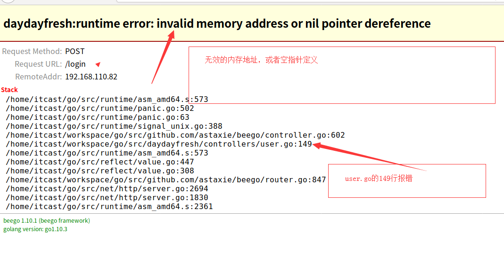
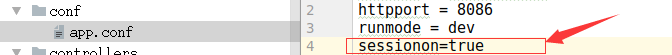

## Session

  今天我们来讲解一下beego框架开发里面的第一种常见的错误，而且有时候这些错误隐藏的不好找，有些地方语法根本没有错误，所有找错误的时候如果没有注意到，那么 就会很不好找bug,特别对于新手来说，如果这些错误不注意那么很容易犯错。
  先来看一下介绍

#### **what is cookie?**

cookie是存储在客户端的，用于标识客户身份的！

#### what is session

session 是存储在服务端，也是用于客户身份标识，用于跟踪用户会话。

#### BeeGo session保存方式

Beego内置了session模块，目前session模块支持的后端引擎包括memory，cookie，file，mysql，redis，couchbase，memcache、postgres，用户也可以根据相应的interface实现自己的引擎。

### 我们先来看一下设置session的语法

```
this.SetSession("userName",username)
```

在beego里设置session的只需要这一句话就行了， 通过这种方式就可以开启session 

```
func (this *MainController) Get() {
    v := this.GetSession("asta")
    if v == nil {
        this.SetSession("asta", int(1))
        this.Data["num"] = 0
    } else {
        this.SetSession("asta", v.(int)+1)
        this.Data["num"] = v.(int)
    }
    this.TplName = "index.tpl"
}

```

着这里我们验证登录的时候看一下如下代码 

```
func (this *Index)ShowIndex(){
	userName:=this.GetSession("userName")   //获取session
	if userName==nil{
		this.Redirect("/login",302)
		return
	}
	this.Data["userName"]=userName   //给后台传数据
	this.TplName="index.html"
}
```

在这里需要注意一下，if userName==nil 这句话，有可能新手会判断为""空字符串，这里的小错不要犯，应该判断为空。

## 常犯错误

有些新手可能经常犯无效的内存地址或空指针异常的错误，如图




报错是这样的，但是到文件中149行查看语句就是 

```
this.SetSession("userName",username)
```

这句语句，这句语句有什么错呢，语法上完全没有错，这时候很多新手可能就会郁闷找不到错误， 这是因为session没有初始化的原因，beego里面session是默认没有初始化的，在开发文档上有两种方式初始化session 

### beego 中使用 session 相当方便，只要在 main 入口函数中设置如下：

```
beego.BConfig.WebConfig.Session.SessionOn = true
```

### 或者通过配置文件配置如下：

```
sessionon = true
```




这样就不会报错了。 