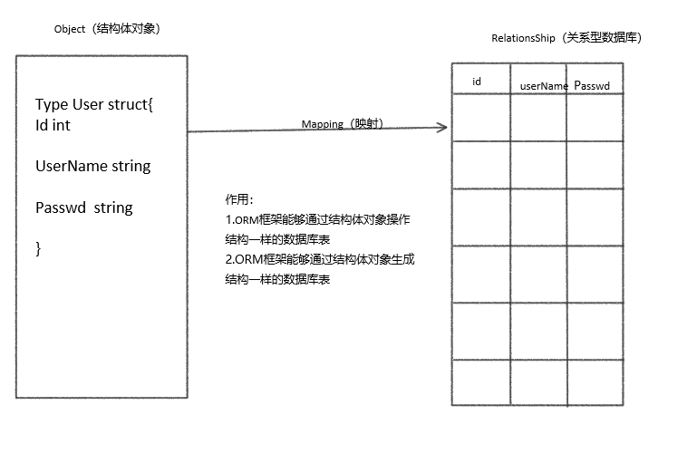

### 2.10 ORM框架

Beego中内嵌了ORM框架，用来操作数据库。那么ORM框架是什么呢？ORM框架是Object-RelationShip-Mapping的缩写，中文叫对象关系映射，他们之间的关系，我们用图来表示：



#### 2.10.1 ORM初始化

- 首先要导包

  ```go
  import "github.com/astaxie/beego/orm"
  ```

- 然后要定义一个结构体

  ```go
  type User struct{
      Id int
      Name string
      PassWord string
  }
  ```

  > 思考:如果表名和字段名为小写会发生什么结果？
  >
  > 注意观察数据库表中的字段和结构体中的字段是否一样？

- 然后向数据库中注册表，这一步又分为三步：

  - 连接数据库

    用RegisterDataBase()函数，第一个参数为数据库别名，也可以理解为数据库的key值，**项目中必须有且只能有一个别名为`default`的连接**，第二个参数是数据库驱动，这里我们用的是MySQL数据库，所以以MySQL驱动为例，第三个参数是连接字符串，和传统操作数据库连接字符串一样，格式为：用户名:密码@tcp(ip:port)/数据库名称?编码方式，代码如下：

    ```go
    orm.RegisterDataBase("default","mysql","root:123456@tcp(127.0.0.1:3306)/class1?charset=utf8")
    ```

    > 注意：ORM只能操作表，不能操作数据库，所以我们连接的数据库要提前在MySQL终端创建好。

  - 注册数据库表

    用orm.RegisterModel()函数，参数是结构体对象，如果有多个表，可以用 ,隔开，多new几个对象：

    ```go
    orm.RegisterModel(new(User))
    ```

  - 生成表

    用orm.RunSyncdb()函数，这个函数有三个参数，

    第一个参数是数据库的别名和连接数据库的第一个参数相对应。

    第二个参数是是否强制更新，一般我们写的都是false，如果写true的话，每次项目编译一次数据库就会被清空一次，fasle的话会在数据库发生重大改变（比如添加字段）的时候更新数据库。

    第三个参数是用来说，生成表过程是否可见，如果我们写成课件，那么生成表的时候执行的SQL语句就会在终端看到。反之看不见。代码如下:

    ```go
    orm.RunSyncdb("default",false,true)
    ```

完整代码如下:

```go
import "github.com/astaxie/beego/orm"

type User struct {
	Id int
	Name string
	Passwd string
}

func init(){
	//1.连接数据库
	orm.RegisterDataBase("default","mysql","root:123456@tcp(127.0.0.1:3306)/test?charset=utf8")
	//2.注册表
	orm.RegisterModel(new(User))
	//3.生成表
	//1.数据库别名
	//2.是否强制更新
	//3.创建表过程是否可见
	orm.RunSyncdb("default",false,true)
}
```

因为这里我们把ORM初始化的代码放到了 models包的init()函数里面，所以如果我们想让他执行的话就需要在main.go里面加入这么一句代码:

```go
import _ "classOne/models"
```

#### 2.10.2 简单的ORM增删改查操作

在执行ORM的操作之前需要先把ORM包导入，但是GoLand会自动帮我们导包，也可以手动导包

```go
import "github.com/astaxie/beego/orm"
```

**插入**

- 先获取一个ORM对象,用orm.NewOrm()即可获得

  ```go
  o := orm.NewOrm()
  ```

- 定义一个要插入数据库的结构体对象

  ```go
  var user User
  ```

- 给定义的对象赋值

  ```go
  user.Name = "itcast"
  user.Passwd = "heima"
  ```

  > 这里不用给Id赋值，因为建表的时候我们没有指定主键，ORM默认会以变量名为Id，类型为int的字段当主键，至于如何指定主键，我们明天详细介绍。

- 执行插入操作，o.Insert()插入，参数是结构体对象，返回值是插入的id和错误信息。

  ```go
  id, err := o.Insert(&user)
  if err == nil {
      fmt.Println(id)
  }
  ```

**查询**    

- 也是要先获得一个ORM对象

  ```go
  o := orm.NewOrm()
  ```

- 定义一个要获取数据的结构体对象

  ```go
  var user User
  ```

- 给结构体对象赋值，相当于给查询条件赋值

  ```go
  user.Name = "itcast"
  ```

- 查询,用o.Read()，第一个参数是对象地址，第二个参数是指定查询字段，返回值只有错误信息。

  ```go
  err := o.Read(&user,"Name")
  if err != nil{
  		beego.Info("查询数据错误",err)
  		return
  	}
  ```

  > 如果查询字段是查询对象的主键的话，可以不用指定查询字段

**更新**

- 一样的套路，先获得ORM对象

  ```go
  o := orm.NewOrm()
  ```

- 定义一个要更新的结构体对象

  ```go
  var user User
  ```

- 给结构体对象赋值，相当于给查询条件赋值

  ```go
  user.Name = "itcast"
  ```

- 查询要更新的对象是否存在

  ```go
  err := o.Read(&user)
  if err != nil{
  	beego.Info("查询数据错误",err)
  	return
  }
  ```

- 如果查找到了要更新的对象,就给这个对象赋新值

  ```go
  user.Passwd = "itheima"
  ```

- 执行更新操作,用o.Update()函数，参数是结构体对象指针，返回值是更新的条目数和错误信息

  ```go
  count,err=o.Update(&user)
  if err != nil{
  	beego.Info("更新数据错误",err)
  	return
  }
  ```

**删除**

- 同样的，获取ORM对象，获取要删除的对象

  ```go
  o := orm.NewOrm()
  var user User
  ```

- 给删除对象赋值，删除的对象主键必须有值，如果主键没值，就查询一下。我们这里直接给主键赋值。

  ```go
  user.Id = 1
  ```

- 执行删除操作，用的方法是o.Delete()，参数是删除的结构体对象,返回值是删除的条目数和错误信息

  ```go
  num, err := o.Delete(&User{Id: 1})
  if err == nil {
      fmt.Println(num)
  }
  ```