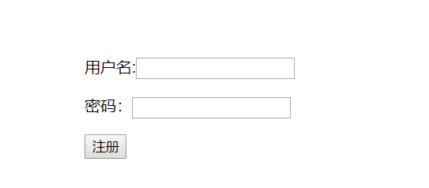

### 3.小Demo讲解

我们今天以注册和登陆作为我们今天的大练习，把今天讲到的内容都串起来。先注册，然后登陆。

在开始具体的业务之前我们要做数据库设计，在正式开发中这一步是非常重要，也比较复杂的，但是今天我们只实现登陆和注册，就简单有个用户名和密码即可，model.go内容如下:

```go
package models

import (
	"github.com/astaxie/beego/orm"
	_ "github.com/go-sql-driver/mysql"
)

type User struct {
	Id int
	Name string
	Passwd string
}

func init(){
	//1.连接数据库
	orm.RegisterDataBase("default","mysql","root:123456@tcp(127.0.0.1:3306)/test?charset=utf8")
	//2.注册表
	orm.RegisterModel(new(User))
	//3.生成表
	//1.数据库别名
	//2.是否强制更新
	//3.创建表过程是否可见
	orm.RunSyncdb("default",false,true)
}
```

### 3.1注册

**确定注册请求路径,修改路由文件**

我们这里以`/register`作为注册的请求路径。所以这里我们需要修改router.go文件的内容。

在router.go文件的init()函数中加下面这行代码:

```go
beego.Router("/register", &controllers.UserController{},"get:ShowRegister")
```

**根据上面路由的指定，我们需要添加注册控制器**

在controllers文件夹下创建一个user.go，然后在这个文件里面定义一个结构体`UserController`当控制器。

```go
type UserController struct{
    beego.Controller
}
```

> 注意这里面添加的`beego.Controller`,是为了继承自beego自带的控制器。

**添加显示注册页面函数**

添加函数的时候需要注意，这个函数必须是`UserController`的函数才可以，不然在路由里面调用不到。那如何把函数设置成`UserController`的成员函数呢？是在函数名前面加上括号，然后放上`UserController`的指针。这里我们先指定注册的视图。代码如下：

```go
func (this*UserController)ShowRegister(){
    this.TplName = "register.html"
}
```

> 注意：这里如果函数名首字母小写，路由同意找不到函数，所以函数名首字母必须大写

**添加视图页面**

在views文件夹下面创建一个名字为`register.html`的文件。然后实现成类似界面：



我们做后台的不关注样式，明天直接拿现成的样式来用即可，我们重在实现功能。

form标签里面需要添加两个属性，一个是action,一个是method，action其实就是请求路径，这里处理的还是注册业务，所以我们还用register请求，action = "/register",因为是上传数据，所以我们把method设置为post,即`method="post"`,代码如下:

```html
<!DOCTYPE html>
<html lang="en">
<head>
    <meta charset="UTF-8">
    <title>注册页面</title>
</head>
<body>

<div style="position:absolute;left:50%; top:50%;">
    <form action="/register" method="post">
        用户名:<input type="text" name="userName">
        <p>   </p>
        密码：<input type="password" name="passwd">
        <p>   </p>
        <input type="submit" value="注册">
    </form>
</div>
</body>
</html>
```

让项目运行起来，然后我们在浏览器里面输入相应的地址就能看见我们的注册页面了。

显示完注册页面之后，接着我们来处理注册的post请求。因为action="/register"，method="post",所以我们可以去router.go界面给post请求指定相应的方法。修改如下：

```go
beego.Router("/register", &controllers.UserController{},"get:ShowRegister;post:HandleRegister")
```

指定方法名之后我们就需要去控制器中实现他。

**注册业务处理**

- 首先在user.go中添加这个函数：

  ```go
  func (this*UserController)HandleRegister(){
  }
  ```

- 接着开始处理注册业务

  - 首先要获取数据。这里给大家介绍一类方法，这类方法将会在我们项目一中高频率的出现，因为他的作用太强大了。

    **this.GetString()：**获取字符串类型值

    **this.GetInt()：**获取整型值

    **this.GetFloat：**获取浮点型值

    ...

    **this.GetFile()：**获取上传的文件

    **作用：**接收前端传递过来的数据，不管是get请求还是post请求，都能接收。

    **参数: ** 是传递数据的key值，一般情况下是form表单中<input>标签的name属性值

    **返回值：**根据返回类型不同，返回值也不一样，最常用的GetString()只有一个返回值，如果没有取到值就返回空字符串，其他几个函数会返回一个错误类型。获取的值一般是<input>标签里面的value属性值。至于比较特殊的，我们用到的时候给大家做介绍。

    知道了获取数据函数，我们就可以获取前端传递过来的数据啦。

  - 获取注册的用户名和密码

    ```go
    userName := this.GetString("userName")
    passwd := this.GetString("passwd")
    ```

  - 对数据进行校验

    一般情况下，我们做服务器开发，从前端拿过来数据都要进行一系列的校验，然后才会用数据对数据库进行操作。不做校验的服务器很容易被黑掉。这里我们只做简单的判空校验。

    ```go
    if userName == "" || passwd == ""{
        beego.Info("数据数据不完整，请重新输入！")
        this.TplName = "register.html"
        return
    }
    ```

    > 思考：如何把那句错误提示传递给视图？

  - 把数据插入数据库

    如果数据校验没有问题，那我们就需要把数据插入到数据库中。数据库插入操作前面刚讲过，这里就不一步一步的分开介绍了，代码如下：

    ```go
    //获取orm对象
    	o := orm.NewOrm()
    	//获取要插入的数据对象
    	var user models.User
    	//给对象赋值
    	user.Name = userName
    	user.Passwd = passwd
    	//把数据插入到数据库
    	if _,err := o.Insert(&user);err != nil{
    		beego.Info("注册失败，请更换用户名再次注册!")
    		this.TplName = "register.html"
    		return
    	}
    ```

    因为我们现在还没有其他界面，如果跳转成功就返回一句话`注册成功`,等我们实现了登陆界面之后再实现注册之后跳转登陆界面的操作。

    给浏览器返回一句化的代码如下：

    ```go
    this.Ctx.WriteString("注册成功!")
    ```

- 完整后台代码如下

  ```go
  //显示注册页面
  func(this*UserController)ShowRegister(){
  	this.TplName = "register.html"
  }
  
  //处理注册业务
  func(this*UserController)HandleRegister(){
  	//获取前端传递的数据
  	userName := this.GetString("userName")
  	passwd := this.GetString("passwd")
  	//对数据进行校验
  	if userName == "" || passwd == ""{
  		beego.Info("数据数据不完整，请重新输入！")
  		this.TplName = "register.html"
  		return
  	}
  	//把数据插入到数据库
  	//获取orm对象
  	o := orm.NewOrm()
  	//获取要插入的数据对象
  	var user models.User
  	//给对象赋值
  	user.Name = userName
  	user.Passwd = passwd
  	//把数据插入到数据库
  	if _,err := o.Insert(&user);err != nil{
  		beego.Info("注册失败，请更换用户名再次注册!")
  		this.TplName = "register.html"
  		return
  	}
  
  	//返回提示信息
  	this.Ctx.WriteString("注册成功!")
  }
  ```

  

### 3.2登陆

登陆和注册业务流程差不多，差别也就体现在一个是对数据的查询一个是数据的插入，讲义里面就不做详细分析，直接贴代码。

**路由文件修改**

添加下面一行代码：

```go
	beego.Router("/login", &controllers.UserController{},"get:ShowLogin;post:HandleLogin")
```

**后台代码修改**

在控制器中添加展示登录页的函数`ShowLogin`和处理登陆数据的函数`HandleLogin`。完整代码如下:

```go
//显示登陆界面
func(this*UserController)ShowLogin(){
	this.TplName = "login.html"
}
//处理登陆业务
func(this*UserController)HandleLogin(){
	//获取前端传递的数据
	userName := this.GetString("userName")
	passwd := this.GetString("passwd")
	//对数据进行校验
	if userName == "" || passwd == ""{
		beego.Info("数据数据不完整，请重新输入！")
		this.TplName = "login.html"
		return
	}
	//查询数据库，判断用户名和密码是否正确
	//获取orm对象
	o := orm.NewOrm()
	//获取要插入的数据对象
	var user models.User
	//给对象赋值
	user.Name = userName
	//根据用户名查询
	if err := o.Read(&user,"Name");err != nil{
		beego.Info("用户名错误，请重新输入！")
		this.TplName = "login.html"
		return
	}
	if user.Passwd != passwd{
		beego.Info("密码错误，请重新输入！")
		this.TplName = "login.html"
		return
	}

	//返回提示信息
	this.Ctx.WriteString("登陆成功!")
}
```

**添加视图文件**

登陆界面和注册界面很相似，拷贝过来简单修改一下即可，代码如下：

```go
<!DOCTYPE html>
<html lang="en">
<head>
    <meta charset="UTF-8">
    <title>登陆页面</title>
</head>
<body>

<div style="position:absolute;left:50%; top:50%;">
    <form action="/login" method="post">
        用户名:<input type="text" name="userName">
        <p>   </p>
        密码：<input type="password" name="passwd">
        <p>   </p>
        <input type="submit" value="登陆">
    </form>
</div>
</body>
</html>
```

这样我们的登陆和注册就算完成了，但是有一个问题，我们的登陆注册还是各干各的，没有关联起来，我们前面等登陆页面实现完之后，注册成功就跳转到登陆页面。现在我们来实现一下跳转。

### 3.3页面之间的跳转

beego里面页面跳转的方式有两种，一种是重定向，一种是渲染，都能够在浏览器上显示新的页面

#### 3.3.1重定向

重定向用到的方法是 this.Redirect() 函数，有两个参数，第一个参数是请求路径，第二个参数是http状态码。

请求路径就不说了，就是和超链接一样的路径。

我们重点介绍一下状态码：

状态码一共分为五类：

1xx : 服务端已经接收到了客户端请求，客户端应当继续发送请求 。常见的请求：100

2xx :请求已成功 （已实现）常见的请求：200

3xx :请求的资源转换路径了，请求被跳转。常见的请求：300，302

4xx :客户端请求失败。常见的请求：404

5xx :服务器端错误。常见的请求：500

状态码详解:http://tool.oschina.net/commons?type=5

重定向的工作流程是：

```重定向的工作流程
1：当服务端向客户端响应 redirect后，并没有提供任何view数据进行渲染，仅仅是告诉浏览器响应为 redirect，以及重定向的目标地址

2：浏览器收到服务端 redirect 过来的响应，会再次发起一个 http 请求

3：由于是浏览器再次发起了一个新的 http 请求，所以浏览器地址栏中的 url 会发生变化

4：浏览中最终得到的页面是最后这个 重定向的url 请求后的页面

5：所以redirect("/register",302) 相当于你在浏览器中手动输入 localhost/register
```

#### 3.3.2渲染

渲染就是控制期把一些数据传递给视图，然后视图用这些输出组织成html界面。所以不会再给浏览器发请求，是服务器自己的行为，所以浏览器的地址栏不会改变，但是显示的页面可能会发生变化。用的函数是:`this.TplName = "login.html"`

#### 3.3.3两者之间的区别

|    区别    |                            重定向                            |                             渲染                             |
| :--------: | :----------------------------------------------------------: | :----------------------------------------------------------: |
|  响应方式  | 告诉浏览器相应是redirect，然后返回一个新的地址给浏览器，让浏览器重新发起请求 |                     直接给浏览器返回视图                     |
| 地址栏显示 |                 浏览器地址栏显示的是新的地址                 |               浏览器地址栏显示的还是原来的地址               |
|    作用    |      不能给视图传递数据，但是能够获取到加载页面时的数据      | 能够给视图传递数据，但如果要获取加载页面时的数据，需要再次写相关代码 |
|  使用场景  |                        页面跳转的时候                        |               页面加载或者是登陆注册失败的时候               |