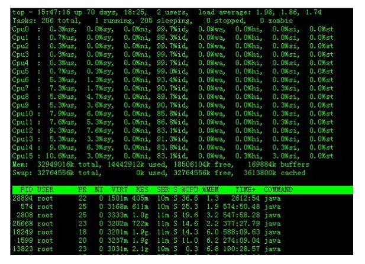
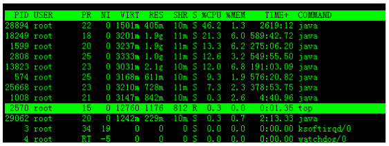

top命令是Linux下常用的性能分析工具，能够实时显示系统中各个进程的资源占用状况，类似于Windows的任务管理器。下面详细介绍它的使用方法。top是一个动态显示过程,即可以通过用户按键来不断刷新当前状态.如果在前台执行该命令,它将独占前台,直到用户终止该程序为止.比较准确的说,top命令提供了实时的对系统处理器的状态监视.它将显示系统中CPU最“敏感”的任务列表.该命令可以按CPU使用.内存使用和执行时间对任务进行排序；而且该命令的很多特性都可以通过交互式命令或者在个人定制文件中进行设定.

## 语法

`top(选项)`

## 选项

```
-b：以批处理模式操作；
-c：显示完整的治命令；
-d：屏幕刷新间隔时间；
-I：忽略失效过程；
-s：保密模式；
-S：累积模式；
-i<时间>：设置间隔时间；
-u<用户名>：指定用户名；
-p<进程号>：指定进程；
-n<次数>：循环显示的次数。
```

## 功能

显示当前系统正在执行的进程的相关信息，包括进程ID、内存占用率、CPU占用率等

## 常用实例

1）显示进程信息

```
# top
top - 14:06:23 up 70 days, 16:44,  2 users,  load average: 1.25, 1.32, 1.35
Tasks: 206 total,   1 running, 205 sleeping,   0 stopped,   0 zombie
Cpu(s):  5.9%us,  3.4%sy,  0.0%ni, 90.4%id,  0.0%wa,  0.0%hi,  0.2%si,  0.0%st
Mem:  32949016k total, 14411180k used, 18537836k free,   169884k buffers
Swap: 32764556k total,        0k used, 32764556k free,  3612636k cached
  PID USER      PR  NI  VIRT  RES  SHR S %CPU %MEM    TIME+  COMMAND                                                                
28894 root      22   0 1501m 405m  10m S 52.2  1.3   2534:16 java                                                                   
18249 root      18   0 3201m 1.9g  11m S 35.9  6.0 569:39.41 java                                                                   
 2808 root      25   0 3333m 1.0g  11m S 24.3  3.1 526:51.85 java                                                        
25668 root      23   0 3180m 704m  11m S 14.0  2.2 360:44.53 java
```

说明：

统计信息区：

前五行是当前系统情况整体的统计信息区。下面我们看每一行信息的具体意义。

第一行，任务队列信息，同 uptime 命令的执行结果，具体参数说明情况如下：

14:06:23 — 当前系统时间

up 70 days, 16:44 — 系统已经运行了70天16小时44分钟（在这期间系统没有重启过的吆！）

2 users — 当前有2个用户登录系统

load average: 1.15, 1.42, 1.44 — load average后面的三个数分别是1分钟、5分钟、15分钟的负载情况。

load average数据是每隔5秒钟检查一次活跃的进程数，然后按特定算法计算出的数值。如果这个数除以逻辑CPU的数量，结果高于5的时候就表明系统在超负荷运转了。

第二行，Tasks — 任务（进程），具体信息说明如下：

系统现在共有206个进程，其中处于运行中的有1个，205个在休眠（sleep），stoped状态的有0个，zombie状态（僵尸）的有0个。

第三行，cpu状态信息，具体属性说明如下：

5.9%us — 用户空间占用CPU的百分比。

3.4% sy — 内核空间占用CPU的百分比。

0.0% ni — 改变过优先级的进程占用CPU的百分比

90.4% id — 空闲CPU百分比

0.0% wa — IO等待占用CPU的百分比

0.0% hi — 硬中断（Hardware IRQ）占用CPU的百分比

0.2% si — 软中断（Software Interrupts）占用CPU的百分比

第五行，swap交换分区信息，具体信息说明如下：

32764556k total — 交换区总量（32GB）

0k used — 使用的交换区总量（0K）

32764556k free — 空闲交换区总量（32GB）

3612636k cached — 缓冲的交换区总量（3.6GB）

备注：

第四行中使用中的内存总量（used）指的是现在系统内核控制的内存数，空闲内存总量（free）是内核还未纳入其管控范围的数量。纳入内核管理的内存不见得都在使用中，还包括过去使用过的现在可以被重复利用的内存，内核并不把这些可被重新使用的内存交还到free中去，因此在linux上free内存会越来越少，但不用为此担心。

如果出于习惯去计算可用内存数，这里有个近似的计算公式：第四行的free + 第四行的buffers + 第五行的cached，按这个公式此台服务器的可用内存：18537836k +169884k +3612636k = 22GB左右。

对于内存监控，在top里我们要时刻监控第五行swap交换分区的used，如果这个数值在不断的变化，说明内核在不断进行内存和swap的数据交换，这是真正的内存不够用了。

第六行，空行。

第七行以下：各进程（任务）的状态监控，项目列信息说明如下：

PID — 进程id

USER — 进程所有者

PR — 进程优先级

NI — nice值。负值表示高优先级，正值表示低优先级

VIRT — 进程使用的虚拟内存总量，单位kb。VIRT=SWAP+RES

RES — 进程使用的、未被换出的物理内存大小，单位kb。RES=CODE+DATA

SHR — 共享内存大小，单位kb

S — 进程状态。D=不可中断的睡眠状态 R=运行 S=睡眠 T=跟踪/停止 Z=僵尸进程

%CPU — 上次更新到现在的CPU时间占用百分比

%MEM — 进程使用的物理内存百分比

TIME+ — 进程使用的CPU时间总计，单位1/100秒

COMMAND — 进程名称（命令名/命令行）

其他使用技巧：

1.多U多核CPU监控

在top基本视图中，按键盘数字“1”，可监控每个逻辑CPU的状况：

观察上图，服务器有16个逻辑CPU，实际上是4个物理CPU。再按数字键1，就会返回到top基本视图界面。



2.高亮显示当前运行进程

 敲击键盘“b”（打开/关闭加亮效果），top的视图变化如下：



我们发现进程id为2570的“top”进程被加亮了，top进程就是视图第二行显示的唯一的运行态（runing）的那个进程，可以通过敲击“y”键关闭或打开运行态进程的加亮效果。

3.进程字段排序

默认进入top时，各进程是按照CPU的占用量来排序的，在下图中进程ID为28894的java进程排在第一（cpu占用142%），进程ID为574的java进程排在第二（cpu占用16%）。


敲击键盘“x”（打开/关闭排序列的加亮效果），top的视图变化如下： 


可以看到，top默认的排序列是“%CPU”。

1. 通过”shift + >”或”shift + <”可以向右或左改变排序列

   ```
   下图是按一次”shift + >”的效果图,视图现在已经按照%MEM来排序。
   ```


2）显示完整命令

```
top -c
```

3）以批处理模式显示程序信息

```
top -b
```

4）以累积模式显示程序信息

```
top -S
```

5）设置信息更新次数

```
top -n 2
```

6）设置信息更新时间

```
top -d 3
```

说明：

表示更新周期为3秒

7）显示指定的进程信息

```
top -p 574
```

## top交互命令

在top 命令执行过程中可以使用的一些交互命令。这些命令都是单字母的，如果在命令行中使用了s 选项， 其中一些命令可能会被屏蔽。

h 显示帮助画面，给出一些简短的命令总结说明

k 终止一个进程。

i 忽略闲置和僵死进程。这是一个开关式命令。

q 退出程序

r 重新安排一个进程的优先级别

S 切换到累计模式

s 改变两次刷新之间的延迟时间（单位为s），如果有小数，就换算成m s。输入0值则系统将不断刷新，默认值是5 s

f或者F 从当前显示中添加或者删除项目

o或者O 改变显示项目的顺序

l 切换显示平均负载和启动时间信息

m 切换显示内存信息

t 切换显示进程和CPU状态信息

c 切换显示命令名称和完整命令行

M 根据驻留内存大小进行排序

P 根据CPU使用百分比大小进行排序

T 根据时间/累计时间进行排序

W 将当前设置写入~/.toprc文件中

参考链接：

<http://www.cnblogs.com/peida/archive/2012/12/24/2831353.html>

<http://man.linuxde.net/top>