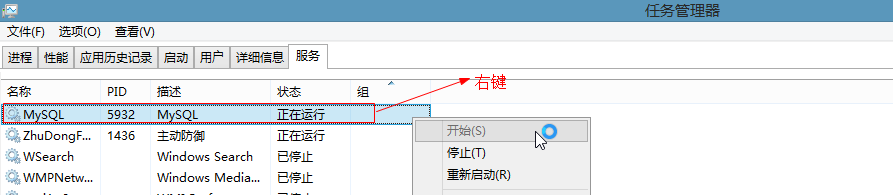

今天来讲解一下MySQL的安装教程

### 1：首先获取一个安装文件，如下图，可以走网上或者某些途径拿到

### 2：然后双击安装，如图

### 3：选择安装模式，这里我们选择自定义安装

### 4：选择数据库以及数据库文件安装位置

在这里我们数据库和数据库文件直接选择安装在C盘下面

### 5：下面一些很多都可以直接点Next选择默认的配置

#### 这里的并发数一般选择系统的默认给我们设置的

#### 端口也选择系统默认的，一般不用改

#### 这里的编码方式选择utf8

#### 服务名称可以自己设置，一般默认，下面的选项是添加环境变量，如果不勾选安装完自己也可以添加一下

#### 这里初始化一下密码

#### 然后点击安装等待4个勾全部勾上点击完成

### 6：MySQL目录

#### 这里是安装的目录，里面的data就是之前选择数据文件安装的路径，我们放在一起所以在这里，你可以自己设置路径

### 7：启动/关闭MySQL服务

### 方法一：在服务面板中启动或关闭

控制面板项——管理工具——服务，选择相应服务，右键执行操作

### 方法二：通过命令行启动\关闭

net start 服务名： 启动MySQL服务

net stop 服务器： 关闭MySQL服务

#### 注意：必须通过管理员身份启动命令行

这样数据库就安装好了，然后就可以进入数据库操作了