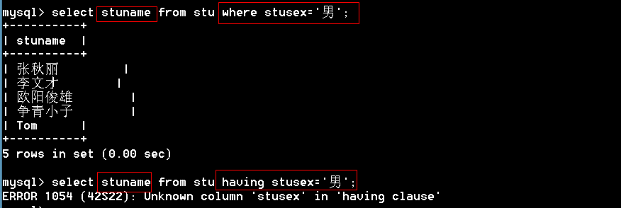
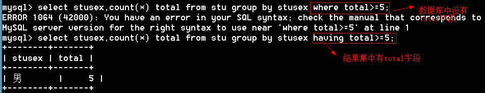

#### 1.6.11 order by排序

asc：升序【默认】

desc：降序

```mysql
mysql> select * from stu order by ch desc;		# 语文成绩降序排列

mysql> select * from stu order by math asc;     # 数学成绩升序排列

mysql> select * from stu order by math;       # 默认升序排列
```

多列排序

```mysql
#年龄升序,成绩降序
mysql> select *,(ch+math) as '总分' from stu order by stuage asc,(ch+math) desc;
```

思考如下代码表示什么含义

```mysql
select * from stu order by stuage desc,ch desc;     #年龄降序，语文降序
select * from stu order by stuage desc,ch asc;		#年龄降序，语文升序
select * from stu order by stuage,ch desc;          #年龄升序、语文降序
select * from stu order by stuage,ch; 				#年龄升序、语文升序
```

#### 1.6.12 group by 【分组查询】

将查询的结果分组，分组查询目的在于统计数据。

```mysql
# 按性别分组，显示每组的平均年龄
mysql> select avg(stuage) as '年龄',stusex from stu group by stusex;
+---------+--------+
| 年龄        | stusex |
+---------+--------+
| 22.7500 | 女      |
| 25.4000 | 男       |
+---------+--------+
2 rows in set (0.00 sec)
# 按地区分组，每个地区的平均年龄
mysql> select avg(stuage) as '年龄',stuaddress from stu group by stuaddress;
+---------+------------+
| 年龄        | stuaddress |
+---------+------------+
| 31.0000 | 上海          |
| 21.3333 | 北京           |
| 27.0000 | 天津           |
| 23.0000 | 河北          |
| 23.0000 | 河南           |
+---------+------------+
5 rows in set (0.00 sec)
```

```
脚下留心：
1、如果是分组查询，查询字段必须是分组字段和聚合函数。
2、查询字段是普通字段，只取第一个值

```

 

通过group_concat()函数将同一组的值连接起来显示

```mysql
mysql> select group_concat(stuname),stusex from stu group by stusex;
+-------------------------------------+--------+
| group_concat(stuname)               | stusex |
+-------------------------------------+--------+
| 李斯文,诸葛丽丽,梅超风,Tabm                           | 女      |
| 张秋丽,李文才,欧阳俊雄,争青小子,Tom                          | 男       |
+-------------------------------------+--------+
2 rows in set (0.00 sec)
```

```
多学一招：【了解】
1、分组后的结果默认会按升序排列显示
2、也是可以使用desc实现分组后的降序

```

 


多列分组

```mysql
mysql> select stuaddress,stusex,avg(stuage) from stu group by stuaddress,stusex;
+------------+--------+-------------+
| stuaddress | stusex | avg(stuage) |
+------------+--------+-------------+
| 上海          | 男       |     31.0000 |
| 北京           | 女      |     22.0000 |
| 北京           | 男       |     21.0000 |
| 天津           | 男       |     27.0000 |
| 河北          | 女      |     23.0000 |
| 河南           | 女      |     23.0000 |
+------------+--------+-------------+
6 rows in set (0.00 sec)
```

#### 1.6.13 having条件

```
思考：数据库中的表是一个二维表，返回的结果是一张二维表，既然能在数据库的二维表中进行查询，能否在结果集的二维表上继续进行查询？

答：可以，having条件就是在结果集上继续进行筛选。

```

例题

```mysql
mysql> select * from stu where stusex='男';   # 从数据库中查找
+--------+----------+--------+--------+---------+------------+------+------+
| stuNo  | stuName  | stuSex | stuAge | stuSeat | stuAddress | ch   | math |
+--------+----------+--------+--------+---------+------------+------+------+
| s25301 | 张秋丽         | 男       |     18 |       1 | 北京           |   80 | NULL |
| s25302 | 李文才        | 男       |     31 |       3 | 上海          |   77 |   76 |
| s25304 | 欧阳俊雄        | 男       |     28 |       4 | 天津           | NULL |   74 |
| s25318 | 争青小子        | 男       |     26 |       6 | 天津           |   86 |   92 |
| s25320 | Tom      | 男       |     24 |       8 | 北京           |   65 |   67 |
+--------+----------+--------+--------+---------+------------+------+------+
5 rows in set (0.00 sec)

mysql> select * from stu having stusex='男';   # 从结果集中查找
+--------+----------+--------+--------+---------+------------+------+------+
| stuNo  | stuName  | stuSex | stuAge | stuSeat | stuAddress | ch   | math |
+--------+----------+--------+--------+---------+------------+------+------+
| s25301 | 张秋丽         | 男       |     18 |       1 | 北京           |   80 | NULL |
| s25302 | 李文才        | 男       |     31 |       3 | 上海          |   77 |   76 |
| s25304 | 欧阳俊雄        | 男       |     28 |       4 | 天津           | NULL |   74 |
| s25318 | 争青小子        | 男       |     26 |       6 | 天津           |   86 |   92 |
| s25320 | Tom      | 男       |     24 |       8 | 北京           |   65 |   67 |
+--------+----------+--------+--------+---------+------------+------+------+
5 rows in set (0.00 sec)
```

思考如下语句是否正确 





having和where的区别：

where是对原始数据进行筛选，having是对记录集进行筛选。 

#### 1.6.14 limit

语法：limit 起始位置，显示长度

```mysql
mysql> select * from stu limit 0,2;    # 从0的位置开始，取两条数据
+--------+---------+--------+--------+---------+------------+------+------+
| stuNo  | stuName | stuSex | stuAge | stuSeat | stuAddress | ch   | math |
+--------+---------+--------+--------+---------+------------+------+------+
| s25301 | 张秋丽        | 男       |     18 |       1 | 北京           |   80 | NULL |
| s25302 | 李文才       | 男       |     31 |       3 | 上海          |   77 |   76 |
+--------+---------+--------+--------+---------+------------+------+------+
2 rows in set (0.00 sec)
 
mysql> select * from stu limit 2,2;    # 从2的位置开始，取两条数据
+--------+----------+--------+--------+---------+------------+------+------+
| stuNo  | stuName  | stuSex | stuAge | stuSeat | stuAddress | ch   | math |
+--------+----------+--------+--------+---------+------------+------+------+
| s25303 | 李斯文        | 女      |     22 |       2 | 北京           |   55 |   82 |
| s25304 | 欧阳俊雄        | 男       |     28 |       4 | 天津           | NULL |   74 |
+--------+----------+--------+--------+---------+------------+------+------+
```

起始位置可以省略，默认是从0开始

```mysql
mysql> select * from stu limit 2;
+--------+---------+--------+--------+---------+------------+------+------+
| stuNo  | stuName | stuSex | stuAge | stuSeat | stuAddress | ch   | math |
+--------+---------+--------+--------+---------+------------+------+------+
| s25301 | 张秋丽        | 男       |     18 |       1 | 北京           |   80 | NULL |
| s25302 | 李文才       | 男       |     31 |       3 | 上海          |   77 |   76 |
+--------+---------+--------+--------+---------+------------+------+------+
2 rows in set (0.00 sec)
```

例题：找出班级总分前三名

```mysql
mysql> select *,(ch+math) total from stu order by total desc limit 0,3;
+--------+----------+--------+--------+---------+------------+------+------+-------+
| stuNo  | stuName  | stuSex | stuAge | stuSeat | stuAddress | ch   | math | total |
+--------+----------+--------+--------+---------+------------+------+------+-------+
| s25318 | 争青小子        | 男       |     26 |       6 | 天津           |   86 |   92 |   178 |
| s25321 | Tabm     | 女      |     23 |       9 | 河北          |   88 |   77 |   165 |
| s25302 | 李文才        | 男       |     31 |       3 | 上海          |   77 |   76 |   153 |
+--------+----------+--------+--------+---------+------------+------+------+-------+
```

多学一招：limit在update和delete语句中也是可以使用的。

#### 1.6.15 查询语句中的选项

查询语句中的选项有两个：

1、     all：显示所有数据 【默认】

2、     distinct：去除结果集中重复的数据

```mysql
mysql> select distinct stuaddress from stu;
+------------+
| stuaddress |
+------------+
| 上海          |
| 天津           |
| 河南           |
| 河北          |
| 北京           |
+------------+
5 rows in set (0.00 sec)
```

## 1.7 union（联合）

插入测试数据

```mysql
mysql> create table GO1(
    -> id int primary key,
    -> name varchar(20));
Query OK, 0 rows affected (0.06 sec)

mysql> insert into Go1 values (1,'李白'),(2,'张秋丽');
Query OK, 2 rows affected (0.02 sec)
Records: 2  Duplicates: 0  Warnings: 0
```

#### 1.7.1 union的使用

作用：将多个select语句结果集纵向联合起来

```mysql
语法：select 语句 union [选项] select 语句 union [选项] select 语句
```

```mysql
mysql> select stuno,stuname from stu union select id,name from Go1;
+--------+----------+
| stuno  | stuname  |
+--------+----------+
| s25301 | 张秋丽         |
| s25302 | 李文才        |
| s25303 | 李斯文        |
| s25304 | 欧阳俊雄        |
| s25305 | 诸葛丽丽         |
| s25318 | 争青小子        |
| s25319 | 梅超风        |
| s25320 | Tom      |
| s25321 | Tabm     |
| 1      | 李白         |
| 2      | 张秋丽         |
+--------+----------+
```

例题：查询上海的男生和北京的女生

```mysql
mysql> select stuname,stuaddress,stusex from stu where (stuaddress='上海' and stusex='男') or (stuaddress='北京' and stusex='女');
+---------+------------+--------+
| stuname | stuaddress | stusex |
+---------+------------+--------+
| 张秋丽        | 上海          | 男       |
| 梅超风       | 北京           | 女      |
+---------+------------+--------+
2 rows in set (0.00 sec)

mysql> select stuname,stuaddress,stusex from stu where stuaddress='上海' and stusex='男' union select stuname,stuaddress,stusex from stu where stuaddress='北京' and stusex='女';
+---------+------------+--------+
| stuname | stuaddress | stusex |
+---------+------------+--------+
| 张秋丽        | 上海          | 男       |
| 梅超风       | 北京           | 女      |
+---------+------------+--------+
2 rows in set (0.02 sec)
```

#### 1.7.2   union的选项

union的选项有两个

1、     all：显示所有数据

2、     distinct：去除重复的数据【默认】

```mysql
mysql> select name from go1 union select stuname from stu;
+----------+
| name     |
+----------+
| 李白         |
| 张秋丽         |
| 李文才        |
| 李斯文        |
| 欧阳俊雄        |
| 诸葛丽丽         |
| 争青小子        |
| 梅超风        |
| Tom      |
| Tabm     |
+----------+
```

默认是去重复的

```mysql
mysql> select name from go1 union all select stuname from stu;  # all不去重复记录
+----------+
| name     |
+----------+
| 李白         |
| 张秋丽         |
| 张秋丽         |
| 李文才        |
| 李斯文        |
| 欧阳俊雄        |
| 诸葛丽丽         |
| 争青小子        |
| 梅超风        |
| Tom      |
| Tabm     |
+----------+
```

#### 1.7.3   union的注意事项

1、     union两边的select语句的字段个数必须一致 

2、     union两边的select语句的字段名可以不一致，最终按第一个select语句的字段名。

 3、     union两边的select语句中的数据类型可以不一致。

 