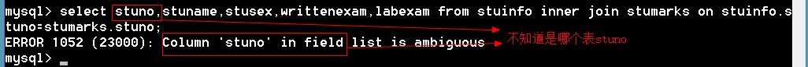
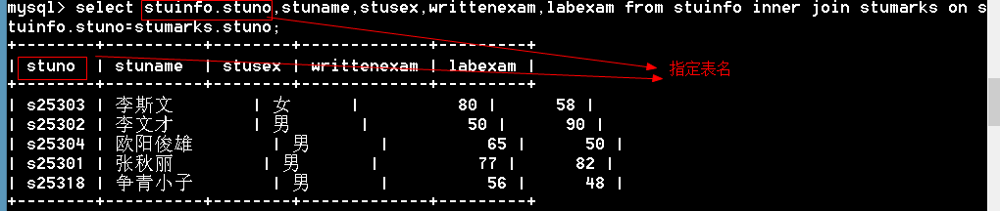

## 1.1  目标

1. 理解多表查询

2. 理解子查询

3. 能够创建视图

4. 能够删除视图

5. 能够查看创建视图的SQL语句

6. 能够理解事务的作用

7. 能够操作事务

8. 理解索引的作用

9. 能够创建索引

10. 能够删除索引

11. 知道常用的函数

12. 了解预处理语句的作用

13. 能够使用预处理语句

14. 了解存储过程的作用

15. 能够创建存储过程

16. 能够调用存储过程

    # 1.2	多表查询分类

    将多个表的数据横向的联合起来。
    1、	内连接
    2、	外连接   左外连接   右外连接
    3、	交叉连接
    4、	自然连接

    #### 1.2.1	内连接【inner join】

    ```
    语法一：select 列名 from 表1 inner join 表2 on 表1.公共字段=表2.公共字段
    
    语法二：select 列名 from 表1,表2 where 表1.公共字段=表2.公共字段
    ```

    例题

    ```mysql
    方法一：
    mysql> select stuname,stusex,writtenexam,labexam from stuinfo inner join stumarks on stuinfo.stuno=stumarks.stuno;
    +----------+--------+-------------+---------+
    | stuname  | stusex | writtenexam | labexam |
    +----------+--------+-------------+---------+
    | 李斯文        | 女      |          80 |      58 |
    | 李文才        | 男       |          50 |      90 |
    | 欧阳俊雄        | 男       |          65 |      50 |
    | 张秋丽         | 男       |          77 |      82 |
    | 争青小子        | 男       |          56 |      48 |
    +----------+--------+-------------+---------+
    
    方法二：
    mysql> select stuinfo.stuno,stuname,stusex,writtenexam,labexam from stuinfo,stumarks where stuinfo.stuno=stumarks.stuno;
    +--------+----------+--------+-------------+---------+
    | stuno  | stuname  | stusex | writtenexam | labexam |
    +--------+----------+--------+-------------+---------+
    | s25303 | 李斯文        | 女      |          80 |      58 |
    | s25302 | 李文才        | 男       |          50 |      90 |
    | s25304 | 欧阳俊雄        | 男       |          65 |      50 |
    | s25301 | 张秋丽         | 男       |          77 |      82 |
    | s25318 | 争青小子        | 男       |          56 |      48 |
    +--------+----------+--------+-------------+---------+
    
    可以给表取别名
    mysql> select i.stuno,stuname,stusex,writtenexam,labexam from stuinfo i,stumarks s where i.stuno=s.stuno;
    +--------+----------+--------+-------------+---------+
    | stuno  | stuname  | stusex | writtenexam | labexam |
    +--------+----------+--------+-------------+---------+
    | s25303 | 李斯文        | 女      |          80 |      58 |
    | s25302 | 李文才        | 男       |          50 |      90 |
    | s25304 | 欧阳俊雄        | 男       |          65 |      50 |
    | s25301 | 张秋丽         | 男       |          77 |      82 |
    | s25318 | 争青小子        | 男       |          56 |      48 |
    +--------+----------+--------+-------------+---------+
    5 rows in set (0.00 sec)
    ```

    脚下留下：显示公共字段需要指定表名





```
思考：
select * from 表1 inner join 表2 on 表1.公共字段=表2.公共字段  和
select * from 表2 inner join 表1 on 表1.公共字段=表2.公共字段   结果是否一样？
答：一样的，因为内连接获取的是两个表的公共部分
```

```
多学一招：三个表的内连接如何实现？
select * from 表1 inner join 表2 on 表1.公共字段=表2.公共字段
inner join 表3 on 表2.公共字段=表3.公共字段
```

#### 1.2.2	左外连接【left join】

以左边的表为标准，如果右边的表没有对应的记录，用NULL填充。

```
语法：select 列名 from 表1 left join 表2 on 表1.公共字段=表2.公共字段
```

例题

```mysql
mysql> select stuname,writtenexam,labexam from stuinfo left join stumarks on stuinfo.stuno=stumarks.stuno;
+----------+-------------+---------+
| stuname  | writtenexam | labexam |
+----------+-------------+---------+
| 张秋丽         |          77 |      82 |
| 李文才        |          50 |      90 |
| 李斯文        |          80 |      58 |
| 欧阳俊雄        |          65 |      50 |
| 诸葛丽丽         |        NULL |    NULL |
| 争青小子        |          56 |      48 |
| 梅超风        |        NULL |    NULL |
+----------+-------------+---------+
```

```
思考：
select * from 表1 left join 表2 on 表1.公共字段=表2.公共字段
和
select * from 表2 left join 表1 on 表1.公共字段=表2.公共字段   是否一样？
答：不一样，左连接一左边的表为准。
```

#### 1.2.3	右外连接【right join】

以右边的表为标准，如果左边的表没有对应的记录，用NULL填充。

```
语法：select 列名 from 表1 right join 表2 on 表1.公共字段=表2.公共字段
```

例题

```mysql
mysql> select stuname,writtenexam,labexam from stuinfo right join stumarks on stuinfo.stuno=stumarks.stuno;
+----------+-------------+---------+
| stuname  | writtenexam | labexam |
+----------+-------------+---------+
| 李斯文        |          80 |      58 |
| 李文才        |          50 |      90 |
| 欧阳俊雄        |          65 |      50 |
| 张秋丽         |          77 |      82 |
| 争青小子        |          56 |      48 |
| NULL     |          66 |      77 |
+----------+-------------+---------+
6 rows in set (0.00 sec)
```

```
思考：
select * from 表1 left join 表2 on 表1.公共字段=表2.公共字段
和
select * from 表2 right join 表1 on 表1.公共字段=表2.公共字段  是否一样？

答：一样的
```

#### 1.2.4	交叉连接【cross join】

插入测试数据

```mysql
mysql> create table t1(
    -> id int,
    -> name varchar(10)
    -> );
Query OK, 0 rows affected (0.06 sec)

mysql> insert into t1 values (1,'tom'),(2,'berry');
Query OK, 2 rows affected (0.00 sec)

mysql> create table t2(
    -> id int,
    -> score int);
Query OK, 0 rows affected (0.02 sec)

mysql> insert into t2 values (1,88),(2,99);
```

1、如果没有连接表达式返回的是笛卡尔积

```mysql
mysql> select * from t1 cross join t2;   # 返回笛卡尔积
+------+-------+------+-------+
| id   | name  | id   | score |
+------+-------+------+-------+
|    1 | tom   |    1 |    88 |
|    2 | berry |    1 |    88 |
|    1 | tom   |    2 |    99 |
|    2 | berry |    2 |    99 |
+------+-------+------+-------+
```

2、如果有连接表达式等价于内连接

```mysql
mysql> select * from t1 cross join t2 where t1.id=t2.id;
+------+-------+------+-------+
| id   | name  | id   | score |
+------+-------+------+-------+
|    1 | tom   |    1 |    88 |
|    2 | berry |    2 |    99 |
+------+-------+------+-------+
```

#### 1.2.5	自然连接【natural】

```
自动的判断连接条件，它是过同名字段来判断的
```

自然连接又分为：

1. 自然内连接		natural join
   . 自然左外连接		natural left join
   . 自然右外连接		natural right join

例题：

```mysql
# 自然内连接
mysql> select * from stuinfo natural join stumarks;
+--------+----------+--------+--------+---------+------------+---------+-------------+---------+
| stuNo  | stuName  | stuSex | stuAge | stuSeat | stuAddress | examNo  | writtenExam | labExam |
+--------+----------+--------+--------+---------+------------+---------+-------------+---------+
| s25303 | 李斯文        | 女      |     22 |       2 | 北京           | s271811 |          80 |
  58 |
| s25302 | 李文才        | 男       |     31 |       3 | 上海          | s271813 |          50 |
  90 |
| s25304 | 欧阳俊雄        | 男       |     28 |       4 | 天津           | s271815 |          65 |
     50 |
| s25301 | 张秋丽         | 男       |     18 |       1 | 北京           | s271816 |          77 |
    82 |
| s25318 | 争青小子        | 男       |     26 |       6 | 天津           | s271819 |          56 |
     48 |
+--------+----------+--------+--------+---------+------------+---------+-------------+---------+
5 rows in set (0.00 sec)

# 自然左外连接

mysql> select * from stuinfo natural left join stumarks;
+--------+----------+--------+--------+---------+------------+---------+-------------+---------+
| stuNo  | stuName  | stuSex | stuAge | stuSeat | stuAddress | examNo  | writtenExam | labExam |
+--------+----------+--------+--------+---------+------------+---------+-------------+---------+
| s25301 | 张秋丽         | 男       |     18 |       1 | 北京           | s271816 |          77
    82 |
| s25302 | 李文才        | 男       |     31 |       3 | 上海          | s271813 |          50 |
  90 |
| s25303 | 李斯文        | 女      |     22 |       2 | 北京           | s271811 |          80 |
  58 |
| s25304 | 欧阳俊雄        | 男       |     28 |       4 | 天津           | s271815 |          65
     50 |
| s25305 | 诸葛丽丽         | 女      |     23 |       7 | 河南           | NULL    |        NULL
   NULL |
| s25318 | 争青小子        | 男       |     26 |       6 | 天津           | s271819 |          56
     48 |
| s25319 | 梅超风        | 女      |     23 |       5 | 河北          | NULL    |        NULL |
ULL |
+--------+----------+--------+--------+---------+------------+---------+-------------+---------+
7 rows in set (0.00 sec)

# 自然右外连接
mysql> select * from stuinfo natural right join stumarks;
+--------+---------+-------------+---------+----------+--------+--------+---------+------------+
| stuNo  | examNo  | writtenExam | labExam | stuName  | stuSex | stuAge | stuSeat | stuAddress |
+--------+---------+-------------+---------+----------+--------+--------+---------+------------+
| s25303 | s271811 |          80 |      58 | 李斯文        | 女      |     22 |       2 | 北京
     |
| s25302 | s271813 |          50 |      90 | 李文才        | 男       |     31 |       3 | 上海
     |
| s25304 | s271815 |          65 |      50 | 欧阳俊雄        | 男       |     28 |       4 | 天津
        |
| s25301 | s271816 |          77 |      82 | 张秋丽         | 男       |     18 |       1 | 北京
       |
| s25318 | s271819 |          56 |      48 | 争青小子        | 男       |     26 |       6 | 天津
        |
| s25320 | s271820 |          66 |      77 | NULL     | NULL   |   NULL |    NULL | NULL       |
+--------+---------+-------------+---------+----------+--------+--------+---------+------------+
6 rows in set (0.00 sec)

```

自然连接结论：

1. 表连接通过同名的字段来连接的

2. 如果没有同名的字段返回笛卡尔积

3. 会对结果进行整理，整理的规则如下

   a)	连接字段保留一个

   b)	连接字段放在最前面

   c)     左外连接左边在前，右外连接右表在前

   ### 1.2.6	using()

4. 用来指定连接字段。

5. using()也会对连接字段进行整理，整理方式和自然连接是一样的。

```mysql
mysql> select * from stuinfo inner join stumarks using(stuno);   # using指定字段
+--------+----------+--------+--------+---------+------------+---------+-------------+---------+
| stuNo  | stuName  | stuSex | stuAge | stuSeat | stuAddress | examNo  | writtenExam | labExam |
+--------+----------+--------+--------+---------+------------+---------+-------------+---------+
| s25303 | 李斯文        | 女      |     22 |       2 | 北京           | s271811 |          80 |
  58 |
| s25302 | 李文才        | 男       |     31 |       3 | 上海          | s271813 |          50 |
  90 |
| s25304 | 欧阳俊雄        | 男       |     28 |       4 | 天津           | s271815 |          65 |
     50 |
| s25301 | 张秋丽         | 男       |     18 |       1 | 北京           | s271816 |          77 |
    82 |
| s25318 | 争青小子        | 男       |     26 |       6 | 天津           | s271819 |          56 |
     48 |
+--------+----------+--------+--------+---------+------------+---------+-------------+---------+
5 rows in set (0.00 sec)
```

