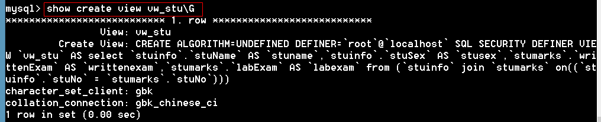

## 1.4	视图【view】

1、	视图是一张虚拟表，它表示一张表的部分或多张表的综合的结构。

2、	视图仅仅是表结构，没有表数据。视图的结构和数据建立在表的基础上。

#### 1.4.1	创建视图

语法

```mysql
create [or replace] view 视图的名称
as
	select语句
```

例题：

```mysql
mysql> create view vw_stu
    -> as
    -> select stuname,stusex,writtenexam,labexam from stuinfo inner join stumarks using(stuno);
Query OK, 0 rows affected (0.00 sec)
```

```
多学一招：因为视图是一个表结构，所以创建视图后，会在数据库文件夹中多一个与视图名同名的.frm文件

```

#### 1.4.2	使用视图

视图是一张虚拟表，视图的用法和表的用法一样

```mysql
mysql> select * from vw_stu;
+----------+--------+-------------+---------+
| stuname  | stusex | writtenexam | labexam |
+----------+--------+-------------+---------+
| 李斯文        | 女      |          80 |      58 |
| 李文才        | 男       |          50 |      90 |
| 欧阳俊雄        | 男       |          65 |      50 |
| 张秋丽         | 男       |          77 |      82 |
| 争青小子        | 男       |          56 |      48 |
+----------+--------+-------------+---------+

mysql> update vw_stu set writtenexam=88 where stuname='李斯文';
Query OK, 1 row affected (0.05 sec)
Rows matched: 1  Changed: 1  Warnings: 0
```

#### 1.4.3	查看视图的结构

语法：

```mysql
desc 视图名
```

例题

```mysql
mysql> desc vw_stu;
+-------------+-------------+------+-----+---------+-------+
| Field       | Type        | Null | Key | Default | Extra |
+-------------+-------------+------+-----+---------+-------+
| stuname     | varchar(10) | NO   |     | NULL    |       |
| stusex      | char(2)     | NO   |     | NULL    |       |
| writtenexam | int(11)     | YES  |     | NULL    |       |
| labexam     | int(11)     | YES  |     | NULL    |       |
+-------------+-------------+------+-----+---------+-------+
```

#### 1.4.4	查看创建视图的语法

语法：

```mysql
show create view 视图名
```

例题

 

#### 1.4.5	显示所有视图

```mysql
 #方法一：
mysql> show tables;
+------------------+
| Tables_in_itcast |
+------------------+
| stu              |
| stuinfo          |
| stumarks         |
| t1               |
| t2               |
| vw_stu           |

# 方法二
mysql> select table_name from information_schema.views;
+------------+
| table_name |
+------------+
| vw_stu     |
+------------+
1 row in set (0.05 sec)
+------------------+

#方法三
mysql> show table status where comment='view' \G
*************************** 1. row ***************************
           Name: vw_stu
         Engine: NULL
        Version: NULL
     Row_format: NULL
           Rows: NULL
 Avg_row_length: NULL
    Data_length: NULL
Max_data_length: NULL
   Index_length: NULL
      Data_free: NULL
 Auto_increment: NULL
    Create_time: NULL
    Update_time: NULL
     Check_time: NULL
      Collation: NULL
       Checksum: NULL
 Create_options: NULL
        Comment: VIEW
1 row in set (0.00 sec)

```

#### 1.4.6	更改视图

语法：

```mysql
alter view 视图名
as
	select 语句
```

例题：

```mysql
mysql> alter view vw_stu
    -> as
    -> select * from stuinfo;
Query OK, 0 rows affected (0.00 sec)
```

#### 1.4.7	删除视图

语法：

```mysql
drop view [if exists] 视图1,视图2,…
```

例题

```mysql
mysql> drop view vw_stu;
Query OK, 0 rows affected (0.00 sec)
```

#### 1.4.8	视图的作用

1. 筛选数据，防止未经许可访问敏感数据

2. 隐藏表结构

3. 降低SQL语句的复杂度

   ### 1.4.9	视图的算法

场景：找出语文成绩最高的男生和女生

```mysql
mysql> select * from (select * from stu order by ch desc) as t group by stusex;
+--------+----------+--------+--------+---------+------------+------+------+
| stuNo  | stuName  | stuSex | stuAge | stuSeat | stuAddress | ch   | math |
+--------+----------+--------+--------+---------+------------+------+------+
| s25321 | Tabm     | 女      |     23 |       9 | 河北          |   88 |   77 |
| s25318 | 争青小子        | 男       |     26 |       6 | 天津           |   86 |   92 |
+--------+----------+--------+--------+---------+------------+------+------+
```

我们可以将子查询封装到视图中

```mysql
mysql> create view vw_stu
    -> as
    -> select * from stu order by ch desc;
Query OK, 0 rows affected (0.00 sec)
```

可以将上面的子查询更改成视图，但是，结果和上面不一样

```mysql
mysql> select * from vw_stu group by stusex;
+--------+---------+--------+--------+---------+------------+------+------+
| stuNo  | stuName | stuSex | stuAge | stuSeat | stuAddress | ch   | math |
+--------+---------+--------+--------+---------+------------+------+------+
| s25301 | 张秋丽        | 男       |     18 |       1 | 北京           |   80 | NULL |
| s25303 | 李斯文       | 女      |     22 |       2 | 北京           |   55 |   82 |
+--------+---------+--------+--------+---------+------------+------+------+
```

原因：这是因为视图的算法造成的

```
1. merge：合并算法，将视图的语句和外层的语句合并后在执行。
2. temptable：临时表算法，将视图生成一个临时表，再执行外层语句
3. undefined：未定义，MySQL到底用merge还是用temptable由MySQL决定，这是一个默认的算法，一般视图都会选择merge算法，因为merge效率高。

```

解决：在创建视图的时候指定视图的算法

```mysql
create algorithm=temptable view 视图名
as
	select 语句
```

指定算法创建视图   

```mysql
mysql> create algorithm=temptable view vw_stu
    -> as
    ->  select * from stu order by ch desc;
Query OK, 0 rows affected (0.00 sec)

mysql> select * from vw_stu group by stusex;   # 结果是一致的
+--------+----------+--------+--------+---------+------------+------+------+
| stuNo  | stuName  | stuSex | stuAge | stuSeat | stuAddress | ch   | math |
+--------+----------+--------+--------+---------+------------+------+------+
| s25321 | Tabm     | 女      |     23 |       9 | 河北          |   88 |   77 |
| s25318 | 争青小子        | 男       |     26 |       6 | 天津           |   86 |   92 |
+--------+----------+--------+--------+---------+------------+------+------+
```

