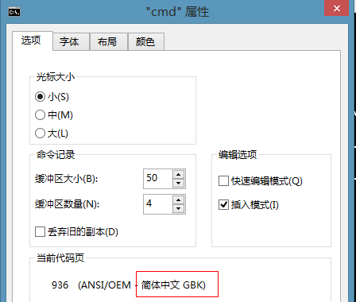
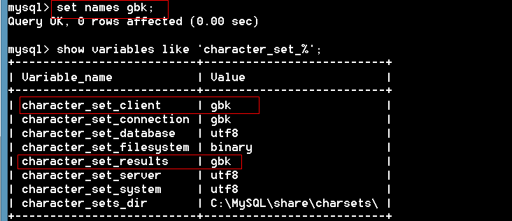

## 1.6 SQL分类

#### DDL（data definition language）数据库定义语言create、alter、drop、shop

#### DML（data manipulation language）数据操纵语言select、update、insert、delete

#### DCL（Data Control Language）数据库控制语言,是用来设置或更改数据库用户或角色权限的语句

###  1.7 数据表的文件介绍

一个数据库对应一个文件夹

一个表对应一个或多个文件

引擎是myisam，一个表对应三个文件


引擎是innodb,一个表对应一个表结构文件


所有的innodb引擎的数据统一的存放在data\ibdata1文件中。如果数据量很大，MySQL会自动的创建ibdata2，ibdata3，…，目的就是为了便于管理。

 引擎是memory，数据存储在内存中，重启服务数据丢失，但是读取速度非常快。

## 1.8 字符集

字符集：字符在保存和传输时对应的二进制编码集合。

创建测试数据库

```mysql
mysql> create table stu(
    -> id int primary key,
    -> name varchar(20)
    -> );
Query OK, 0 rows affected (0.00 sec)
```

插入中文报错


分析原因：

客户端通过GBK发送的命令



但是，服务用utf8解释命令


设置服务器，用gbk字符编码接受客户端发来的命令


测试：插入中文，成功


查询数据，发现数据乱码


原因：以utf返回的结果，客户端用gbk来接受

解决：服务器用gbk返回数据


再次测试，查询数据


总结：客户端编码、character_set_client、character_set_results三个编码的值一致即可操作中文。

多学一招：我们只要设置“set names 字符编码”，就可以更改character_set_client、character_set_results的值。



