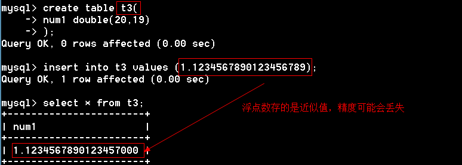

## 1.1 数据类型——值类型

#### 1.1.1   整型

|   类型    | 字节 |       范围       |
| :-------: | :--: | :--------------: |
|  tinyint  |  1   |     -128~127     |
| smallint  |  2   |   -32768~32767   |
| mediumint |  3   | -8388608~8388607 |
|    int    |  4   |  -2^31^~2^31^-1  |
|  bigint   |  8   |  -2^63^~2^63^-1  |

1、无符号整数（unsigned）：无符号数没有负数，正数部分是有符号的两倍。

 例题

```mysql
mysql> create table stu(
    -> id smallint unsigned auto_increment primary key comment '主键',
    -> age tinyint unsigned not null comment '年龄',
    -> money bigint unsigned comment '存款'
    -> );
Query OK, 0 rows affected (0.06 sec)

mysql> desc stu;
+-------+----------------------+------+-----+---------+----------------+
| Field | Type                 | Null | Key | Default | Extra          |
+-------+----------------------+------+-----+---------+----------------+
| id    | smallint(5) unsigned | NO   | PRI | NULL    | auto_increment |
| age   | tinyint(3) unsigned  | NO   |     | NULL    |                |
| money | bigint(20) unsigned  | YES  |     | NULL    |                |
+-------+----------------------+------+-----+---------+----------------+
3 rows in set, 3 warnings (0.00 sec)
```

2、整型支持显示宽度（最小的显示位数）  比如int(5)，如果数值的位数小于5位，前面加上前导0。比如输入12，显示00012；大于5位就不添加前导0。

```
脚下留心：必须结合zerofill才起作用
```

```mysql
mysql> create table stu(
    -> id int(5),
    -> age int(5) zerofill   # 填充前导0
    -> );
Query OK, 0 rows affected (0.02 sec)

mysql> desc stu;
+-------+--------------------------+------+-----+---------+-------+
| Field | Type                     | Null | Key | Default | Extra |
+-------+--------------------------+------+-----+---------+-------+
| id    | int(5)                   | YES  |     | NULL    |       |
| age   | int(5) unsigned zerofill | YES  |     | NULL    |       |
+-------+--------------------------+------+-----+---------+-------+
2 rows in set (0.02 sec)

mysql> insert into stu values (1,11);
mysql> insert into stu values (1111111,2222222);
Query OK, 1 row affected (0.00 sec)

mysql> select * from stu;
+---------+---------+
| id      | age     |
+---------+---------+
|       1 |   00011 |
| 1111111 | 2222222 |    # 注意：age填充了前导0
+---------+---------+
2 rows in set (0.00 sec)
```

#### 1.1.2   浮点型（保存近似值小数）

|      浮点型      | 占用字节 |        范围        |
| :--------------: | :------: | :----------------: |
| float（单精度）  |    4     |  -3.4E+38~3.4E+38  |
| double（双精度） |    8     | -1.8E+308~1.8E+308 |

 1、浮点数声明:  float(M,D)   double(M,D)

M：总位数

D：小数位数

 例题；

```mysql
mysql> create table t1(
    -> num1 float(5,2),   #总位数是5，小数位数是2，那么整数位数是3，
    -> num2 double(4,1)
    -> );
Query OK, 0 rows affected (0.08 sec)

mysql> insert into t1 values (1.23,1.23); #如果精度超出了允许的范围，会四舍五入
Query OK, 1 row affected (0.00 sec)

mysql> select * from t1;
+------+------+
| num1 | num2 |
+------+------+
| 1.23 |  1.2 |   #如果精度超出了允许的范围，会四舍五入
+------+------+
1 row in set (0.00 sec)
```

2、浮点的精度可能会丢失【精度指的是小数】



#### 1.1.3   定点数

语法：decimal(M,D)

```
mysql> create table t4(
    -> num decimal(20,19)
    -> );
Query OK, 0 rows affected (0.00 sec)

mysql> insert into t4 values (1.1234567890123456789);
Query OK, 1 row affected (0.01 sec)

mysql> select * from t4;
+-----------------------+
| num                   |
+-----------------------+
| 1.1234567890123456789 |
+-----------------------+
1 row in set (0.00 sec)
```

```
多学一招：
1、定点数是变长的，大致每9个数字用4个字节来存储。定点数之所以能保存精确的小数，因为整数和小数是分开存储的。占用的资源比浮点数要多。
2、定点数和浮点数都支持显示宽度和无符号数。
```

## 1.2 数据类型——字符型

|   数据类型    |   描述   |     长度      |
| :-----------: | :------: | :-----------: |
|  char(长度)   |   定长   |    最大255    |
| varchar(长度) |   变长   |   最大65535   |
|   tinytext    | 大段文本 |  2^8^-1=255   |
|     text      | 大段文本 | 2^16^-1=65535 |
|  mediumtext   | 大段文本 |    2^24^-1    |
|   longtext    | 大段文本 |    2^32^-1    |

1、char(10)和varchar(10)的区别？

答：相同点：它们最多只能保存10个字符；

​        不同点：char不回收多余的字符，varchar会回收多余的字符。

​                        char效率高，浪费空间，varchar节省空间，效率比char低。

2、char的最大长度是255。  


3、varchar理论长度是65535字节,实际根本达不到。具体长度与字符编码有关。 


4、一个记录的总长度不能超过65535个字节。

 5、大块文本（text）不计算在总长度中,一个大块文本只占用10个字节来保存文本的地址。 


