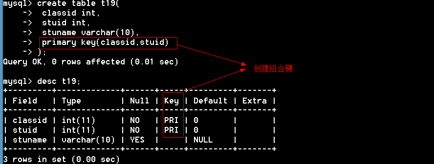
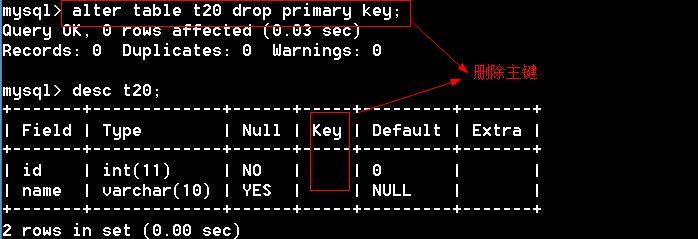
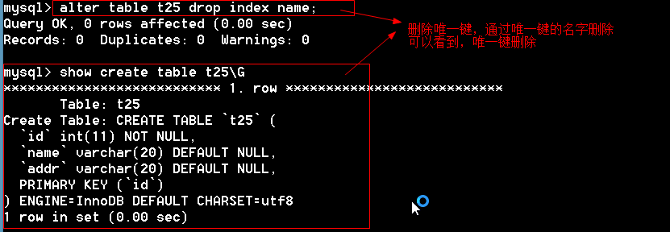
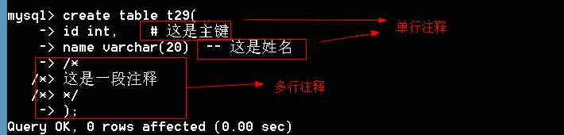

### 1.11.2 创建组合键



#### 1.11.3 查看主键


#### 1.11.3 删除主键



#### 1.11.4 选择主键的原则

1、     最少性：尽量选择一个字段做主键

2、     稳定性：尽量选择更新少的列做主键

3、     尽量选择数字型的列做主键

#### 1.11.5 主键思考题

1、在主键列输入的数值，允许为空吗?       不可以                 

2、 一个表可以有多个主键吗?                     不可以                    

3、 在一个学校数据库中，如果一个学校内允许重名的学员，但是一个班级内不允许学员重名，可以组合班级和姓名两个字段一起来作为主键吗？                  可以

4、 标识列（自动增长列）允许为字符数据类型吗？     不可以       

5、 表中没有合适的列作为主键怎么办？      添加自动增加列              

6、  如果标识列A的初始值为1，增长量为1，则输入三行数据以后，再删除两行，下次再输入数据行的时候，标识值从多少开始？          从4开始

## 1.12    列属性——唯一键

特点：

1、不能重复，可以为空

2、一个表可以有多个唯一键

作用：

1、     保证数据不能重复。保证数据完整性

2、     加快数据访问

#### 1.12.1 添加唯一键

方法一：创建表的时候添加唯一键

```mysql
mysql> create table t22(
    -> id int primary key,
    -> name varchar(20) unique,    #通过unique添加唯一键
    -> addr varchar(100) unique
    -> );
Query OK, 0 rows affected (0.00 sec)

mysql> insert into t22 values (1,'tom','上海');
Query OK, 1 row affected (0.05 sec)

mysql> insert into t22 values (2,'tom','北京');    #  name重复了，报错
ERROR 1062 (23000): Duplicate entry 'tom' for key 'name'
mysql> insert into t22 values (2,'berry','上海');   # addr重复了 
ERROR 1062 (23000): Duplicate entry '上海' for key 'addr'
```

还有一种方法

```mysql
mysql> create table t26(
    -> id int,
    -> name varchar(20),
    -> addr varchar(20),
    -> primary key(id),
    -> unique (name),     # 添加唯一键
    -> unique (addr)
    -> );
Query OK, 0 rows affected (0.06 sec)
```


方法二：修改表的时候添加唯一键

```mysql
mysql> create table t23(
    -> id int primary key,
    -> name varchar(20)
    -> );
Query OK, 0 rows affected (0.02 sec)

mysql> alter table t23 add unique (name);    #  添加一个唯一键
Query OK, 0 rows affected (0.02 sec)
Records: 0  Duplicates: 0  Warnings: 0
```

一次添加多个唯一键

```mysql
mysql> create table t24(
    -> id int primary key,
    -> name varchar(20),
    -> addr varchar(20)
    -> );
Query OK, 0 rows affected (0.06 sec)

mysql> alter table t24 add unique(name),add unique(addr);  
Query OK, 0 rows affected (0.09 sec)
Records: 0  Duplicates: 0  Warnings: 0
```

添加组合唯一键

```mysql
mysql> create table t25(
    -> id int primary key,
    -> name varchar(20),
    -> addr varchar(20)
    -> );
Query OK, 0 rows affected (0.09 sec)

mysql> alter table t25 add unique(name,addr);
Query OK, 0 rows affected (0.01 sec)
Records: 0  Duplicates: 0  Warnings: 0
```

#### 1.12.2查看唯一键

```mysql
mysql> show create table t26\G
*************************** 1. row ***************************
       Table: t26
Create Table: CREATE TABLE `t26` (
  `id` int(11) NOT NULL DEFAULT '0',
  `name` varchar(20) DEFAULT NULL,
  `addr` varchar(20) DEFAULT NULL,
  PRIMARY KEY (`id`),
  UNIQUE KEY `name` (`name`),      # 唯一键
  UNIQUE KEY `addr` (`addr`)       # 唯一键
) ENGINE=InnoDB DEFAULT CHARSET=utf8
1 row in set (0.00 sec)

mysql> show create table t25\G
*************************** 1. row ***************************
       Table: t25
Create Table: CREATE TABLE `t25` (
  `id` int(11) NOT NULL,
  `name` varchar(20) DEFAULT NULL,
  `addr` varchar(20) DEFAULT NULL,
  PRIMARY KEY (`id`),
  UNIQUE KEY `name` (`name`,`addr`)    # 组合唯一键
) ENGINE=InnoDB DEFAULT CHARSET=utf8
1 row in set (0.00 sec)
```

添加唯一键，给唯一键取名

```mysql
mysql> create table t27(
    -> name varchar(20)
    -> );
Query OK, 0 rows affected (0.03 sec)

mysql> alter table t27 add unique UQ_name(name);
Query OK, 0 rows affected (0.00 sec)
Records: 0  Duplicates: 0  Warnings: 0

mysql> show create table t27\G
*************************** 1. row ***************************
       Table: t27
Create Table: CREATE TABLE `t27` (
  `name` varchar(20) DEFAULT NULL,
  UNIQUE KEY `UQ_name` (`name`)    # 唯一键的名字是UQ_name
) ENGINE=InnoDB DEFAULT CHARSET=utf8
1 row in set (0.00 sec)
```

#### 1.12.3 删除唯一键

通过唯一键的名字来删除唯一键

```
语法：alter table 表名 drop index 唯一键名称
```



问题：主键和唯一键的区别？

1、主键不能重复，不能为空，唯一键不能重复，可以为空

2、主键只有一个，唯一键可以有多个。

## 1.13列属性——备注（comment）

为了程序员之间的相互交流  


## 1.14    SQL注释

单行注释：--或#

多行注释：/*    */



