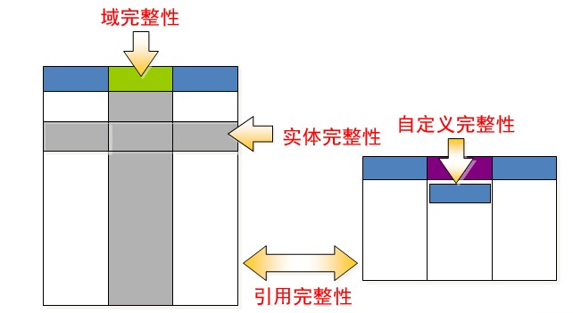

### 1.15    数据完整性介绍



#### 1.15.1 保证实体完整性

1、     主键约束

2、     唯一约束

3、     自动增长列

#### 1.15.2 保证域完整性

1、     数据类型约束

2、     非空约束

3、     默认值约束

#### 1.15.3 保证引用完整性

1、外键约束：从表中的公共字段是主表的外键

## 1.16  引用完整性

#### 1.16.1 主表和从表

两个表建立关系（两个表只要有公共字段就有关系），一个表称为主表，一个表称为从表。

外键约束可以实现：

1、     主表中没有的从表中不允许插入

2、     从表中有的主表中不允许删除

3、     不能更改主表中的值而导致从表中的记录孤立存在。

4、     先删除从表，再删除主表

#### 1.16.2    外键（foreign key）

1、     外键：从表中的公共字段，公共字段的名字可以不一样，但是数据类型必须一样。

2、     外键约束用来保证引用完整性

#### 1.16.3 添加外键

方法一：创建表的时候添加外键

```mysql
create table stuinfo(
	stuno char(4) primary key,
	name varchar(10) not null
);

create table stumarks(
	stuid char(4) primary key,
	score tinyint unsigned,
	foreign key (stuid) references stuinfo(stuno)
);
```

 方法二：修改表的时候添加外键

```mysql
mysql> create table stuinfo(
    ->  stuno char(4) primary key,
    ->  name varchar(10) not null
    -> );
Query OK, 0 rows affected (0.00 sec)

mysql> create table stumarks(
    ->  stuid char(4) primary key,
    ->  score tinyint unsigned
    -> );
Query OK, 0 rows affected (0.06 sec)

语法：  alter table 从表 add foreign key (从表的公共字段) references 主表(公共字段)

mysql> alter table stumarks add foreign key (stuid) references stuinfo(stuno);
Query OK, 0 rows affected (0.06 sec)
Records: 0  Duplicates: 0  Warnings: 0
```

脚下留心：要创建外键必须是innodb引擎，myisam不支持外键约束

#### 1.16.4 查看外键


#### 1.16.5 删除外键

通过外键的名字删除外键

```mysql
语法：alter table 表名 drop foreign key 外键名
```

例题

```mysql
mysql> alter table stumarks drop foreign key stumarks_ibfk_1;
Query OK, 0 rows affected (0.02 sec)
Records: 0  Duplicates: 0  Warnings: 0
```

。

## 1.17 外键操作

1、     严格操作（前面讲的是严格操作）

2、     置空操作（set null）：如果主表记录删除或更新，从表置空

3、     级联操作（cascade）：如果主表记录删除或更新，从表级联

一般来说：主表删除的时候，从表置空操作，主表更新的时候，从表级联操作。

```mysql
语法：foreign key(外键) references 主表(关键字段)[主表删除是的动作][主表更新时候的动作]
```

例题

```mysql
mysql> create table stuinfo(
    -> stuno char(4) primary key,
    -> name varchar(10) not null
    -> );
Query OK, 0 rows affected (0.02 sec)

mysql> create table stumarks(
    -> stuid int auto_increment primary key,
    -> stuno char(4) ,
    -> score tinyint unsigned,
    ->  foreign key (stuno) references stuinfo(stuno) on delete set null on update cascade
    -> );
Query OK, 0 rows affected (0.00 sec)

mysql> insert into stuinfo values ('s101','tom');
Query OK, 1 row affected (0.00 sec)

mysql> insert into stumarks values (null,'s101',88);
Query OK, 1 row affected (0.00 sec)

mysql> select * from stuinfo;
+-------+------+
| stuno | name |
+-------+------+
| s101  | tom  |
+-------+------+
1 row in set (0.00 sec)

mysql> update stuinfo set stuno='s102' where stuno='s101';   # 更新时级联
Query OK, 1 row affected (0.00 sec)
Rows matched: 1  Changed: 1  Warnings: 0

mysql> select * from stumarks;
+-------+-------+-------+
| stuid | stuno | score |
+-------+-------+-------+
|     1 | s102  |    88 |
+-------+-------+-------+
1 row in set (0.00 sec)

mysql> delete from stuinfo where stuno='s102';    # 删除时置空
Query OK, 1 row affected (0.02 sec)

mysql> select * from stumarks;
+-------+-------+-------+
| stuid | stuno | score |
+-------+-------+-------+
|     1 | NULL  |    88 |
+-------+-------+-------+
1 row in set (0.00 sec)

```

## 1.18客户端介绍

第一：命令行

第二：MySQL-Front和Navicat

#### MySQL-Front


