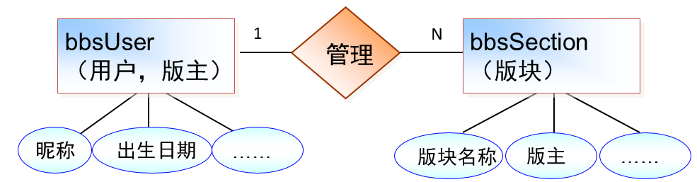
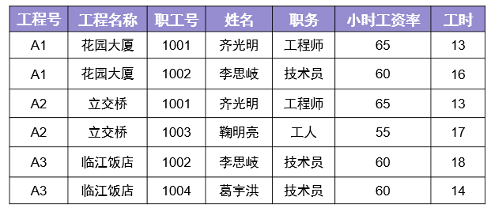

## 1.1 今日目标

1. 理解实体之间的关系

2. 理解绘制E-R图

3. 理解三范式

4. 理解范式和性能的关系

   ## 1.2  数据库基本概念

   1、关系：两个表的公共字段

   2、行：也称记录，也称实体

   3、列：也称字段，也称属性

   ```
   就表结构而言，表分为行和列；
   就表数据而言，分为记录和字段；
   就面向对象而言，一个记录就是一个实体，一个字段就是一个属性。
   ```

   4、数据冗余：相同的数据存储在不同的地方

   ```
   脚下留心：
   1、冗余只能减少，不能杜绝。
   2、减少冗余的方法是分表
   3、为减少数据查找的麻烦，允许数据有一定的冗余
   ```

   5、数据完整性：正确性+准确性=数据完整性

   ```
   正确性：数据类型正确
   准确性：数据范围要准确
   ```

   思考：学生的年龄是整型，输入1000岁，正确性和准确性如何？

   答：正确的，但不准确

   思考：年龄是整形的，收入了字符串，正确性和准确性如何？

   答：不正确

    

   ## 1.3  实体和实体之间的关系

   1、一对一

   2、一对多 （多对一）

   3、多对多 

   

   

#### 1.3.1 一对多 1：N

1、主表中的一条记录对应从表中的多条记录。

2、一对多和多对一是一样的

如何实现一对多？

答：主键和非主键建关系

问题：说出几个一对多的关系？

答：班级表和学生表、      班主表和学生表

#### 1.3.2   一对一（1:1）

1、主表中的一条记录对应从表中的一条记录


如何实现一对一？

主键和主键建关系就能实现一对一。

```
思考：一对一两个表完全可以用一个表实现，为什么还要分成两个表？

答：在字段数量很多情况下，数据量也就很大，每次查询都需要检索大量数据，这样效率低下。我们可以将所有字段分成两个部分，“常用字段”和“不常用字段”，这样对大部分查询者来说效率提高了。【表的垂直分割】
```


#### 1.3.3   多对多（N：M）

主表中的一条记录对应从表中的多条记录，从表中的一条记录对应主表中的多条记录

班级和老师的关系

如何实现多对多？

答：建立第三张表来保存关系。

问题：说出几个多对多的关系？

1、科目表和学生表的关系		2、商品表和订单表         3、游戏目录表和玩家表


## 1.4 数据库设计的步骤


#### 1.4.1   数据库设计具体步骤

1、     收集信息：与该系统有关人员进行交流、坐谈，充分理解数据库需要完成的任务

2、     标识对象（实体－Entity）标识数据库要管理的关键对象或实体 

3、     标识每个实体的属性（Attribute）

4、     标识对象之间的关系（Relationship）

5、     将模型转换成数据库

6、     规范化

#### 1.4.2   绘制E-R图

  E-R（Entity－Relationship）实体关系图 

E-R图的语法


绘制E-R图



#### 1.4.3   将E-R图转成表

1、     实体转成表，属性转成字段

2、     如果没有合适的字段做主键，给表添加一个自动增长列做主键。


#### 1.4.4  例题

1、项目需求

```
BBS论坛的基本功能：
用户注册和登录，后台数据库需要存放用户的注册信息和在线状态信息；
用户发贴，后台数据库需要存放贴子相关信息，如贴子内容、标题等；
用户可以对发帖进行回复；
论坛版块管理：后台数据库需要存放各个版块信息，如版主、版块名称、贴子数等；
```

2、标识对象

​	参与的对象有：用户、发的帖子、跟帖、板块

3、标识对象的属性


4、建立关系，绘制E-R图


5、将E-R图转出表结构


## 1.5 数据规范化

Codd博士定义了6个范式来规范化数据库，范式由小到大来约束，范式越高冗余越小，但表的个数也越多。实验证明，三范式是性价比最高的。 

#### 1.5.1   第一范式：确保每列原子性

第一范式确保每个字段不可再分


思考：如下表设计是否合理？


不合理。不满足第一范式，上课时间可以再分


思考：地址包含省、市、县、地区是否需要拆分？

答：如果仅仅起地址的作用，不需要统计，可以不拆分；如果有按地区统计的功能需要拆分。

在实际项目中，建议拆分。

 

#### 1.5.2   第二范式：非键字段必须依赖于键字段

一个表只能描述一件事


思考：如下表设计是否合理？


#### 1.5.3   第三范式：消除传递依赖

在所有的非键字段中，不能有传递依赖


下列设计是否满足第三范式？


不满足，因为语文和数学确定了，总分就确定了。

```
多学一招：上面的设计不满足第三范式，但是高考分数表就是这样设计的，为什么？

答：高考分数峰值访问量非常大，这时候就是性能更重要。当性能和规范化冲突的时候，我们首选性能。这就是“反三范式”。
```

#### 1.5.4  数据库设计的例题

1、需求

```
公司承担多个工程项目，每一项工程有：工程号、工程名称、施工人员等
公司有多名职工，每一名职工有：职工号、姓名、性别、职务（工程师、技术员）等
公司按照工时和小时工资率支付工资，小时工资率由职工的职务决定（例如，技术员的小时工资率与工程师不同）
```

2、工资表


3、将工资表转成数据库表



4、这个表存在的问题

​	A：新人入职需要虚拟一个项目

​	B：职务更改，小时工资率可能会忘记更改，造成数据不完整

​	C：有人离职，删除记录后，工程也没有了

5、规范化表

​	第一步：这个表满足第一范式

​	第二步：这个表不是描述了一件事情


第三步：是否满足第三范式


更改如下：


