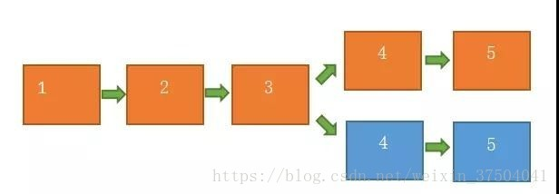

**此区块链100篇文章为在博客上看到较好的区块链解释，所以搜集而来，转载博客原地址https://blog.csdn.net/weixin_37504041**

> 遵循相同机制的分叉 

我在第六篇讲到了一种情况就是在比特币网络中，在某一时刻有两个矿工同时算出随机数（即获得记账权），那么这个时候便会出现一种情况，即一条主链叉开变成两条叉链，每条链沿着各自的方向延伸下去，如下图所示： 

之所以会出现这种情况是因为每个矿工在开始挖新的区块之前都会先把上一个区块复制过来，然后接上这个区块进行下一个区块的挖矿工作。而现在在全网中的同一时刻有两个符合条件的区块，那么由于距离的远近（P2P网络），矿工找到的区块是不一样的（虽然这两个区块都是符合条件的区块），所以有一些矿工会拿到橙色的区块进行下面的挖矿工作，而有一些矿工会拿到蓝色的区块进行挖矿工作，这就势必导致上图所示的情况，这种情况叫分叉。
对于此类情况，比特币有一个很好的机制，就是上文提到的短链服从长链，那么为了达到这种效果比特币是如何做的呢？
首先区块是由矿工挖出来的，矿工进行挖矿就需要矿机（以后会专门讲矿机），而不同的矿机具有不同的算力（每秒运算多少次），也就是说每个矿工的计算能力是不一样的，那么，就会出现一种情况，即两条链中会有一条链的算力要比另一条链大，因此这条链的增长速度就会比另一条链要快，也就是这条链会比另一条链长。这时你可能会说那如果两条链的算力一直保持一样呢？这种情况是不可能会出现的，在短时间内是可能的，但一段时间后这种平衡势必会被打破，比如有新的矿机出来（新的矿机算力一般都比较高），那么就会有矿工去购买来替换旧的矿机，这就会导致算力不平衡。

但其中一条链超过另外一条链时，这时全网中就会出现一条最长链，那么矿工在进行新的打包区块工作的时候会把最长链全部复制过来，再在这条链的基础上继续挖矿，当所有矿工都这样做的时候那么这条链就会成为一条主链，而另外一条链就会被抛弃掉，如下图所示：

到这里可能会有一个疑问，就是如果矿工执意要在那条短链上进行挖矿呢？如果这个矿工聪明一点的话他就知道这么做是吃力不讨好的，因为一旦他所在的链最后没有成为主链的话，他在这条连上挖到的比特币都会归零，他之前所做的工作都白费的，所以一般不会去做这种事。
好了，到这里或许能明白比特币是如何保证系统中账本唯一性的了，但是需要注意的是这里所有的矿工都是遵循相同的机制，比如每条链的每个区块都是1M大小。那么如果一条链1M大小一条链是8M大小呢？比特币系统还会不会同样的保留最长链丢弃短链呢？继续往下看。

> 遵循不同机制的分叉
>

如果是遵循不同的机制也会出现分叉，一般分为软分叉和硬分叉。

> 1.软分叉
> 软分叉好理解一点，就是当系统进行升级时（比如比特币将一个区块的大小从1M扩容到8M），有一些矿工还没来得及升级，那么就会出现一条链是1M的，一条链是8M。这种情况也好解决，只需要这部分矿工进行升级就行了，那么那条1M的链就会自动消失，而且对全网没有任何的影响。
> 这里可以把软分叉理解为一个人换了一件新的衣服，人还是那个人，只是样子看起来变了。
>

> 2.硬分叉
> 当整个区块链网络中，系统版本或协议升级后，且和老版本协议不兼容，未升级的老节点无法接受新节点挖出的全部或者部分区块，导致出现了两条链，假设新节点的算力较大，新节点们在维护一条链，老节点也始终在维护一条他认可的链，如果这时候大多数的节点都开始升级为新版本，那么老节点维护的链能不能存活就看算力有多少了，这就称作硬分叉。直白点就是一条链真的分叉成两条链，且这两条链互不兼容，是两条独立的主链，这两条链唯一的联系就是在分叉前的数据都是一样，而分叉后全都不一样，举个例子就是一块地基上原来有了一座旧房子，这时在这块地基上重新建另一座房子，建成后两者除了在同一块地基上之外就没有任何联系了。

关于硬分叉最有名的当属以太坊的The DAO事件，感兴趣的可以自行查资料，这件事导致了以太坊分叉形成两条不同的主链，一条是以太坊（ETH），一条是以太经典（ETC），现在两条链都同时存在。

