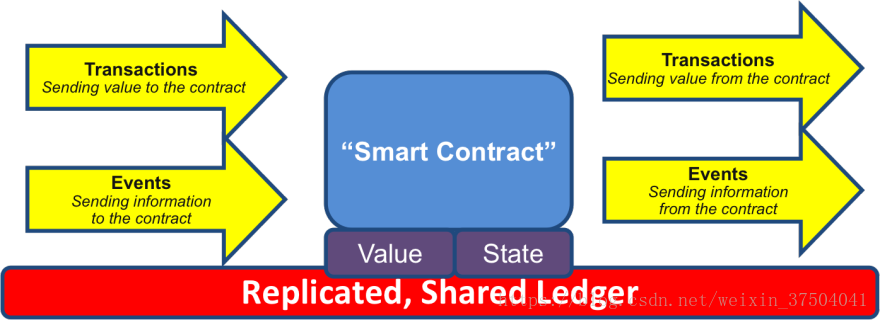

**此区块链100篇文章为在博客上看到较好的区块链解释，所以搜集而来，转载博客原地址https://blog.csdn.net/weixin_37504041**

> 一、比特币的转账过程 

我在第五篇讲UTXO的时候，有提到比特币的转账过程，现在来回顾一下这个过程。

> Bob想要转给Jack一百个比特币，Bob需要先创建一笔交易，因为这笔交易只有被矿工验证并打包进区块的时候才算完成交易，Bob在填写交易信息的时候除了需要提供支付比特币的数额以及双方的地址外，还需要提供自己的公钥以及用私钥生成的数字签名，还有就是上一笔交易的Hash（也就是Bob从哪里得到这些比特币）；信息填完后（其实在现实中没这么复杂，只需要在钱包中填写转入转出地址以及交易金额即可，其他的都是自动的）便可以点击确认，当这笔交易广播到全网中时，矿工开始对这笔交易进行验证，第一步会去找到上一笔交易，确认支付方的比特币来源；接着第二步算出支付方公钥的指纹，确认与支付方的地址一致，从而保证公钥属实；然后第三步是使用公钥去解开数字签名，保证私钥属实。验证通过后矿工便会将这笔交易打包进区块中，如果得到六次以上的确认，则可以认为这笔交易不会再被改变。

讲这个过程就是为了引出今天的知识点–智能合约。

> 二、比特币与智能合约
>

在上面我有讲到Bob需要提供的交易信息有一个是上一笔的交易Hash，我们可以来看一下区块链中时如何记录这笔交易的（这其实就是一个UTXO），如下图所示：

可以看出Bob转给Jack的100个比特币是从Alice那得到的，图中还可以看到一个解锁信息，这个解锁信息时候用来证明这100个比特币的归属，因为只有Bob的私钥才能进行解锁，其他人进行解锁是无效的。
到这里我们可以将这个UTXO看做是一个简单的智能合约，因为它是一个可自动执行并且自我验证协议，Bob只要输入自己的私钥，解锁脚本就会自动运行校验，解锁成功便说明Bob是这100个比特币的拥有者，反之则说明不是。

因为比特币所支持的脚本语言只跟交易有关，并且不是图灵完备的语言，所能做的事很有限，但是比特币的出现极大地促进了智能合约的发展，现在支持编写智能合约的平台中最有名的当属以太坊。

> 三、智能合约 

上世纪90年代，密码学家尼克萨博从自动贩卖机得到灵感首次提出“智能合约”的概念，看一下智能合约的定义： 

- > 智能合约是指一种计算机协议，这类协议一旦制定和部署成功就能实现自我执行（self-executing）和自我验证（self-verifying），而且不再需要人为的干预。

智能合约会对接收到的信息进行回应，它可以接收和储存价值，也可以向外发送信息和价值。看一张图： 

从图中可以看出一段代码（智能合约），被部署在分享的、复制的账本上，它可以维持自己的状态，控制自己的资产和对接收到的外界信息或者资产进行回应。
举个例子，现在我们对银行账户内存款的操作都需要中心化的银行进行授权，一旦离开了银行的监管，用户就连最基本的存取款操作都无法进行，但是如果是使用智能合约来处理的话情况就不一样了，只要事先正确的通过严谨的逻辑写好代码，便可以不需要人工参与，一切都将按事先写好的逻辑运行，并且结果是公平公正的，因此也有人宣称“代码即法律”，这个观点保留意见，至少以目前的情况来看事情没那么简单。

智能合约的概念虽然很早就被提出来了，但是因为很多技术的不成熟，所以发展很缓慢，但是因为比特币的出现或者说因为区块链技术的出现，智能合约开始成为研究人员与业内人士重点研究的对象，这都极大促进了智能合约的发展。

> 四、智能合约的优缺点 

参考《区块链技术指南》简单列出智能合约的优点。 

> 首先是***高效的实时更新***，因为智能合约的执行是去中心化的，也就是不需要认为的干预，所以它的执行效率是很高的，你不再需要亲自去相关部门提交排队提交申请资料，然后还需要等几个工作日才能得到结果，现在只需要在网上填好资料点击提交，如果网络通畅，几分钟内便能办完手续，方便快捷。
> 第二便是***较低的人为干预风险***，因为智能合约是一开始就制定好的，并且是无法更改的，所以一旦出现毁约的情况，那么时间的责任人就会得到相应的惩罚，这保证了公平公正性，也就是说在智能合约面前，人人平等，没有谁有特权。
> 第三就是***准确运行***， 智能合约是一段执行在计算机上的代码，所以只要运行的计算机没错县错误，那么这个合约的执行结果都是准确无误的，不会出现不可预料的情况，之所以能做到这一点也是得益于密码学的发展和区块链技术的发明。
> 第四是***去中心化权威***，在区块链网络中一般不存在一个绝对的权威来监督合约的执行，而是由绝大部分的用户来判断合约是否正常执行，这种绝大多数人监督的方式是由POW或POS等共识机制来实现的。
>
> 第五便是***较低的运行成本***，正因为智能合约具有去人为干预的特点，其能够大大减少合约履行、裁决和强制执行所产生的人力成本。

关于智能合约的缺点，我讲一下我的理解，因为智能合约的一段可执行的代码，是代码便不可避免的会存在bug，一旦出现bug或者不可预料的情况，这对于采用智能合约的应用都是极大的挑战（可以参考The DAO事件），这是因为智能合约是去人工干预的。智能合约的优点目前也是它的缺点，但是随着技术的发展，它的这个缺点或许可以被忽略。

> 五、以太坊与智能合约 

说到智能合约就不能不讲到以太坊，与比特币相比，以太坊最大的不同点是它可以支持更加强大的脚本语言（图灵完备的脚本语言），允许开发者在上面开发任意应用，实现任意智能合约，这也是以太坊的最强大之处。作为平台，以太坊可以类比于苹果的应用商店，任何开发者都可以在上面开发应用，并出售给用户。以太坊也是目前支持智能合约的区块链平台中比较成熟的平台。

