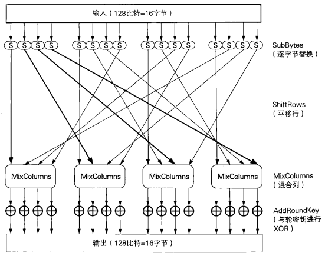
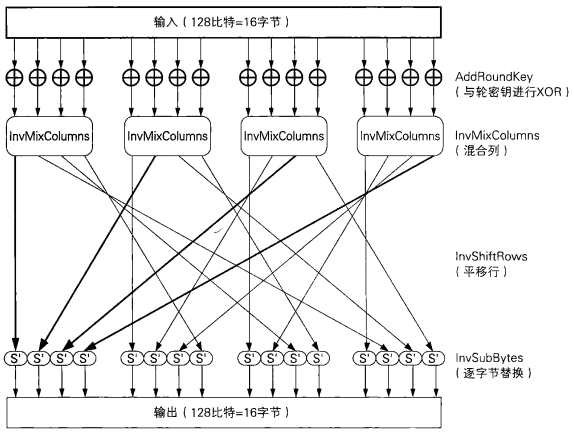

### 1.AES

> AES（Advanced Encryption Standard）是取代其前任标准（DES）而成为新标准的一种对称密码算法。全世界的企业和密码学家提交了多个对称密码算法作为AES的候选，最终在2000年从这些候选算法中选出了一种名为==**Rijndael**==的对称密码算法，并将其确定为了AES。
>
> Rijndael是由比利时密码学家Joan Daemen和Vincent Rijmen设汁的分组密码算法，今后会有越来越多的密码软件支持这种算法。
>
> **==Rijndael的分组长度为128比特==**，密钥长度可以以32比特为单位在128比特到256比特的范围内进行选择（不过==**在AES的规格中，密钥长度只有128、192和256比特三种**==）。
>
> 128bit = 16字节
>
> 192bit = 24字节
>
> 256bit = 32字节
>
> 在go提供的接口中秘钥长度只能是16字节

#### 2.AES的加密和解密

0123456789ABCDEF

ABCDEFGHIJKLMNOP

> 和DES—样，AES算法也是由多个轮所构成的，下图展示了每一轮的大致计算步骤。DES使用Feistel网络作为其基本结构，而AES没有使用Feistel网络，而是使用了SPN Rijndael的输人分组为128比特，也就是16字节。
>
> 首先，需要逐个字节地对16字节的输入数据进行SubBytes处理。所谓SubBytes,就是以每个字节的值（0～255中的任意值）为索引，从一张拥有256个值的替换表（S-Box）中查找出对应值的处理，也是说，将一个1字节的值替换成另一个1字节的值。
>
> SubBytes之后需要进行ShiftRows处理，即将SubBytes的输出以字节为单位进行打乱处理。从下图的线我们可以看出，这种打乱处理是有规律的。
>
> ShiftRows之后需要进行MixColumns处理，即对一个4字节的值进行比特运算，将其变为另外一个4字节值。
>
> 最后，需要将MixColumns的输出与轮密钥进行XOR，即进行AddRoundKey处理。到这里，AES的一轮就结東了。实际上，在AES中需要重复进行10 ~ 14轮计算。
>
> 通过上面的结构我们可以发现输入的所有比特在一轮中都会被加密。和每一轮都只加密一半输人的比特的Feistel网络相比，这种方式的优势在于加密所需要的轮数更少。此外，这种方式还有一个优势，即SubBytes，ShiftRows和MixColumns可以分别按字节、行和列为单位进行并行计算。



```
SubBytes		-- 	字节代换

ShiftRows		--	行移位代换

MixColumns	--	列混淆	

AddRoundKey	--	轮密钥加
```


> 下图展示了AES中一轮的解密过程。从图中我们可以看出，SubBytes、ShiftRows、MixColumns分别存在反向运算InvSubBytes、InvShiftRows、InvMixColumns，这是因为AES不像Feistel网络一样能够用同一种结构实现加密和解密。



```
InvSubBytes		--	逆字节替代

InvShiftRows		--	逆行移位

InvMixColumns	--	逆列混淆
```


#### 3.Go中对AES的使用

##### 加解密实现思路

- **加密 - CBC分组模式**

  > 1. 创建并返回一个使用AES算法的cipher.Block接口
  >    - **秘钥长度为128bit, 即 128/8 = 16字节(byte)**
  > 2. 对最后一个明文分组进行数据填充
  >    - AES是以128比特的明文（比特序列）为一个单位来进行加密的
  >    - 最后一组不够128bit, 则需要进行数据填充( **参考第三章**)
  > 3. 创建一个密码分组为链接模式的, 底层使用AES加密的BlockMode接口
  > 4. 加密连续的数据块

- **解密**

  > 1. 创建并返回一个使用AES算法的cipher.Block接口
  > 2. 创建一个密码分组为链接模式的, 底层使用AES解密的BlockMode接口
  > 3. 数据块解密
  > 4. 去掉最后一组的填充数据

##### 加解密的代码实现

AES加密代码

```go
// AES加密
func AESEncrypt(src, key []byte) []byte{
	// 1. 创建一个使用AES加密的块对象
	block, err := aes.NewCipher(key)
	if err != nil{
		panic(err)
	}
	// 2. 最后一个分组进行数据填充
	src = PKCS5Padding(src, block.BlockSize())
	// 3. 创建一个分组为链接模式, 底层使用AES加密的块模型对象
	blockMode := cipher.NewCBCEncrypter(block, key[:block.BlockSize()])
	// 4. 加密
	dst := src
	blockMode.CryptBlocks(dst, src)
	return dst
}
```

AES解密

```go
// AES解密
func AESDecrypt(src, key []byte) []byte{
	// 1. 创建一个使用AES解密的块对象
	block, err := aes.NewCipher(key)
	if err != nil{
		panic(err)
	}
	// 2. 创建分组为链接模式, 底层使用AES的解密模型对象
	blockMode := cipher.NewCBCDecrypter(block, key[:block.BlockSize()])
	// 3. 解密
	dst := src
	blockMode.CryptBlocks(dst, src)
	// 4. 去掉尾部填充的字
	dst = PKCS5UnPadding(dst)
	return dst
}
```

重要的函数说明

1. 生成一个底层使用AES加/解密的Block接口对象

   ```go
   函数对应的包: import "crypto/aes"
   func NewCipher(key []byte) (cipher.Block, error)
   	- 参数 key: aes对称加密使用的密码, 密码长度为128bit, 即16byte
   	- 返回值 cipher.Block: 创建出的使用AES加/解密的Block接口对象
   ```

2. 创建一个密码分组为CBC模式, 底层使用b加密的BlockMode接口对象

   ```go
   函数对应的包: import "crypto/cipher"
   func NewCBCEncrypter(b Block, iv []byte) BlockMode
       - 参数 b: 使用aes.NewCipher函数创建出的Block接口对象
       - 参数 iv: 事先准备好的一个长度为一个分组长度的比特序列, 每个分组为64bit, 即8byte
       - 返回值: 得到的BlockMode接口对象
   ```

3. 使用cipher包的BlockMode接口对象对数据进行加/解密

   ```go
   接口对应的包: import "crypto/cipher"
   type BlockMode interface {
       // 返回加密字节块的大小
       BlockSize() int
       // 加密或解密连续的数据块，src的尺寸必须是块大小的整数倍，src和dst可指向同一内存地址
       CryptBlocks(dst, src []byte)
   }
   接口中的 CryptBlocks(dst, src []byte) 方法:
       - 参数 dst: 传出参数, 存储加密或解密运算之后的结果 
       - 参数 src: 传入参数, 需要进行加密或解密的数据切片(字符串)
   ```

4. 创建一个密码分组为CBC模式, 底层使用b解密的BlockMode接口对象

   ```go
   函数对应的包: import "crypto/cipher"
   func NewCBCDecrypter(b Block, iv []byte) BlockMode
       - 参数 b: 使用des.NewCipher函数创建出的Block接口对象
       - 参数 iv: 事先准备好的一个长度为一个分组长度的比特序列, 每个分组为128bit, 即16byte, 
                  该序列的值需要和NewCBCEncrypter函数的第二个参数iv值相同
       - 返回值: 得到的BlockMode接口对象
   ```

