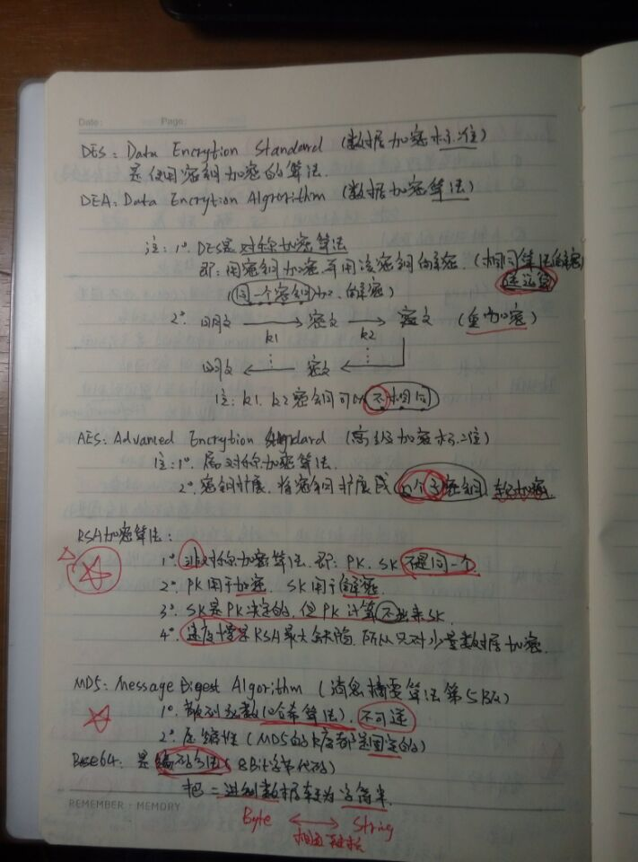
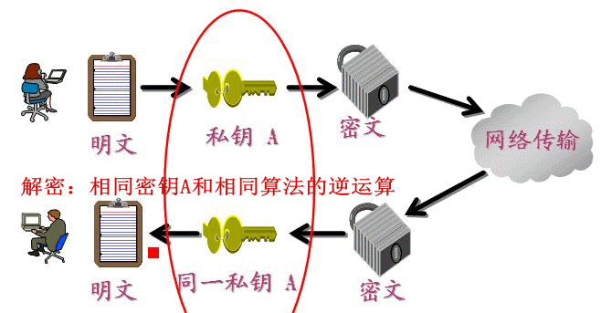
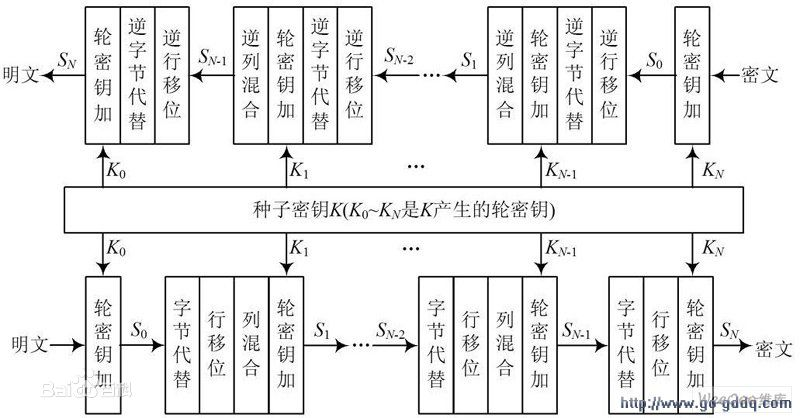
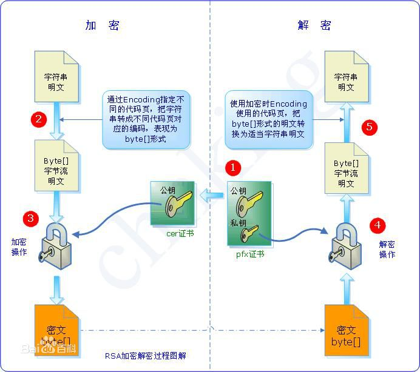
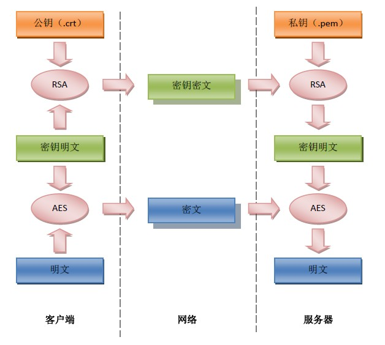

转载：<https://blog.csdn.net/m0_37543627/article/details/71244473> 

BASE64：编码方式（8位字节代码），二进制与字符串相互转换 

MD5：Message Algorithm（消息摘要算法第五版），散列函数（哈希算法）_不可逆，压缩性

DES：Data Encrytion Standard（数据加密标准），对应算法是DEA

​             特点：1. 对称加密 2. 同一个SK

AES：Advanced Encrytion Standard（高级加密标准）

​             特点：1. 对称加密 2. 一个SK扩展成多个子SK，轮加密

RSA：特点： 1. 非对称加密，即：PK与SK不是同一个

​                         2. PK用于加密，SK用于解密

​                         3. PK决定SK，但是PK很难算出SK（数学原理：两个大质数相乘，积很难因式分解）

​                         4. 速度慢，只对少量数据加密

相关总结图片：

DES加密： 

AES加密： 

RSA加密： 

SSL使用RSA： 

