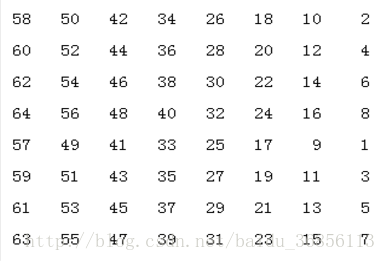
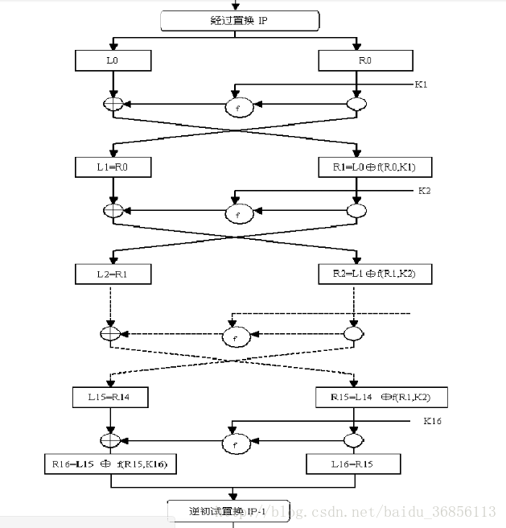
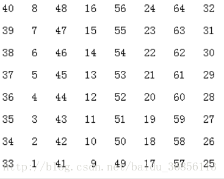
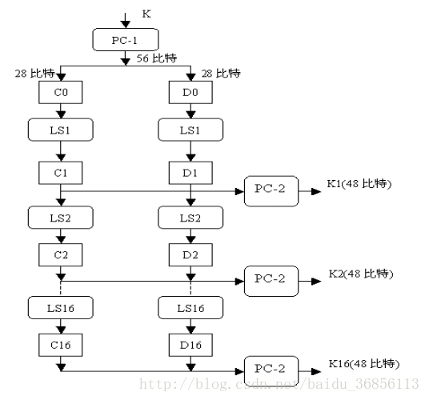
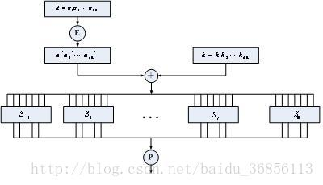
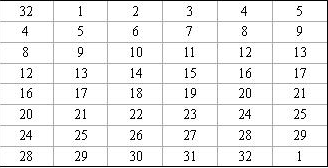

本文来自 ：<https://blog.csdn.net/baidu_36856113/article/details/53558795> 

1997年数据加密标准DES正式公布，其分组长度为64比特，密钥长度为64比特，其中8比特为奇偶校验位，所以实际长度为56比特。现在DES已经被AES所取代。

 **1）DES的加密过程** 明文64位->初始置换IP->16轮加密变换->逆初始置换IP-1->密文

 **a.初始置换IP** 

这里的初始IP置换表的意思为把64位明文按照表中的规则替换，比如第一行，把64位明文的第1位换为其58位，第2位换为50位，第3位换位42位…这表仔细观察有一定的规律，比如我们从右到左一列一列的分别读前4行，后4行。是不是就是2 4 6 8 10 12…和1 3 5 7 9 11…

**b.16轮加密变换** 

看似很复杂，其实16轮的过程都是一样的。经过上面说的初始置换IP,接下来就是要把64位分为L0和R0各32位。然后算出f(R0,k1),其结果与L0异或作为R1.而L1直接是和R0相等的。 后面都一样： Li=Ri-1 Ri=Li-1异或f(Ri-1,ki) i=1,2,3,…16, 这时我们就会问那K1~K16从哪来，加密函数f()怎么计算，这些问题我在后面会继续写的。

 **c.初始逆置换IP-1** 

方法同初始置换IP。

 **b1.密钥生成**  

是不是一下子就能看明白，这里的PC-1为选择置换，可以去掉奇偶校验位。PC-2也是选择置换，它是用于从Ci和Di中选取48位作为密钥Ki。C0和D0是把密钥中实际的56位分成左右28位，LSi是表示对Ci-1和Di-1进行循环左移变换，其中LS1,LS2,LS9,LS16是循环左移1位，其余为2位。
**选择置换PC-1**
57, 49, 41, 33, 25, 17, 9,
1, 58, 50, 42, 34, 26, 18,
10, 2, 59, 51, 43,35, 27,
19, 11, 3, 60, 52, 44, 36,

63, 55, 47, 39, 31, 23, 15,
7, 62, 54, 46, 38, 30, 22,
14, 6, 61, 53, 45, 37, 29,
21, 13, 5, 28, 20, 12, 4，
**选择置换PC-2**
14, 17, 11, 24, 1, 5,
3, 28, 15, 6, 21, 10,
23, 19, 12, 4, 26, 8,
16, 7, 27, 20, 13, 2,
41, 52, 31, 37, 47, 55,
30, 40, 51, 45, 33, 48,
44, 49, 39, 56, 34, 53,
46, 42, 50, 36, 29, 32
**b2.加密函数f()**

这里的E是把32比特（即上面所提到的64比特分为俩个32比特。）的输入扩展为48比特。将E置换后的结果与48位的Ki异或的结果平均分为8组B1,B2…B8，每组Bi用Si盒处理。这样你会发现进去的是48位，出来的是32位。因为P为32位置换函数，它的输入为32位。把Bi{x1,x2,x3…x6}(48比特平均分为8组，每组就是6比特)中的x1x6和x2x3x4x5分别作为Si盒的行和列（比如x1x2x3…x6=101011,则x1x6=11把它转化为十进制为3。x2x3x4x5=0101转换为十进制为5，所以为3行5列，但是要注意Si盒的行列从0开始算起），找到这个十进制数，把它转化为4位二进制。这4位就是输出。 

**扩展变换E** 

这个也是有规律的把第一列和最后一列去掉看看。 

**S盒**

 S1 14, 4, 13, 1, 2, 15, 11, 8, 3, 10, 6, 12, 5, 9, 0, 7, 0, 15, 7, 4, 14, 2, 13, 1, 10, 6, 12, 11, 9, 5, 3, 8, 4, 1, 14, 8, 13, 6, 2, 11, 15, 12, 9, 7, 3, 10, 5, 0, 15, 12, 8, 2, 4, 9, 1, 7, 5, 11, 3, 14, 10, 0, 6, 13,

 S2 15, 1, 8, 14, 6, 11, 3, 4, 9, 7, 2, 13, 12, 0, 5, 10, 3, 13, 4, 7, 15, 2, 8, 14, 12, 0, 1, 10, 6, 9, 11, 5, 0, 14, 7, 11, 10, 4, 13, 1, 5, 8, 12, 6, 9, 3, 2, 15, 13, 8, 10, 1, 3, 15, 4, 2, 11, 6, 7, 12, 0, 5, 14, 9, 

S3 10, 0, 9, 14, 6, 3, 15, 5, 1, 13, 12, 7, 11, 4, 2, 8, 13, 7, 0, 9, 3, 4, 6, 10, 2, 8, 5, 14, 12, 11, 15, 1, 13, 6, 4, 9, 8, 15, 3, 0, 11, 1, 2, 12, 5, 10, 14, 7, 1, 10, 13, 0, 6, 9, 8, 7, 4, 15, 14, 3, 11, 5, 2, 12, 

S4 7, 13, 14, 3, 0, 6, 9, 10, 1, 2, 8, 5, 11, 12, 4, 15, 13, 8, 11, 5, 6, 15, 0, 3, 4, 7, 2, 12, 1, 10, 14, 9, 10, 6, 9, 0, 12, 11, 7, 13, 15, 1, 3, 14, 5, 2, 8, 4, 3, 15, 0, 6, 10, 1, 13, 8, 9, 4, 5, 11, 12, 7, 2, 14, 

S5 2, 12, 4, 1, 7, 10, 11, 6, 8, 5, 3, 15, 13, 0, 14, 9, 14, 11, 2, 12, 4, 7, 13, 1, 5, 0, 15, 10, 3, 9, 8, 6, 4, 2, 1, 11, 10, 13, 7, 8, 15, 9, 12, 5, 6, 3, 0, 14, 11, 8, 12, 7, 1, 14, 2, 13, 6, 15, 0, 9, 10, 4, 5, 3, 

S6 12, 1, 10, 15, 9, 2, 6, 8, 0, 13, 3, 4, 14, 7, 5, 11, 10, 15, 4, 2, 7, 12, 9, 5, 6, 1, 13, 14, 0, 11, 3, 8, 9, 14, 15, 5, 2, 8, 12, 3, 7, 0, 4, 10, 1, 13, 11, 6, 4, 3, 2, 12, 9, 5, 15, 10, 11, 14, 1, 7, 6, 0, 8, 13, 

S7 4, 11, 2, 14, 15, 0, 8, 13, 3, 12, 9, 7, 5, 10, 6, 1, 13, 0, 11, 7, 4, 9, 1, 10, 14, 3, 5, 12, 2, 15, 8, 6, 1, 4, 11, 13, 12, 3, 7, 14, 10, 15, 6, 8, 0, 5, 9, 2, 6, 11, 13, 8, 1, 4, 10, 7, 9, 5, 0, 15, 14, 2, 3, 12, 

S8 13, 2, 8, 4, 6, 15, 11, 1, 10, 9, 3, 14, 5, 0, 12, 7, 1, 15, 13, 8, 10, 3, 7, 4, 12, 5, 6, 11, 0, 14, 9, 2, 7, 11, 4, 1, 9, 12, 14, 2, 0, 6, 10, 13, 15, 3, 5, 8, 2, 1, 14, 7, 4, 10, 8, 13, 15, 12, 9, 0, 3, 5, 6, 11 , 

**p置换** 16, 7, 20, 21, 29, 12, 28, 17, 1, 15, 23, 26, 5, 18, 31, 10, 2, 8, 24, 14, 32, 27, 3, 9, 19, 13, 30, 6, 22, 11, 4, 25 