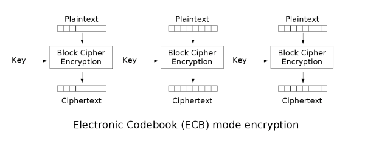
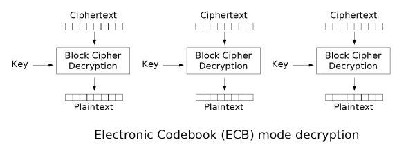
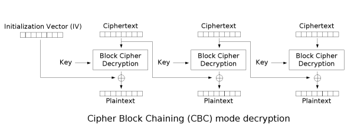

## 基本概念

- 密码学中，块密码的工作模式（英语：mode of operation）允许使用同一个块密码密钥对多于一块的数据进行加密，并保证其安全性。
- 块密码自身只能加密长度等于密码块长度的单块数据，若要加密变长数据，则数据必须先被划分为一些单独的密码块。通常而言，最后一块数据也需要使用合适填充方式将数据扩展到符合密码块大小的长度。
- 一种工作模式描述了加密每一数据块的过程，并常常使用基于一个通常称为初始化向量的附加输入值以进行随机化，以保证安全。
- 常见的模式有ECB，CBC，OFB，CFB，CTR和XTS等
- 加密模式仅仅保证 *机密性* ，对于保证 *完整性* 或未篡改，需要采用分离的消息验证码，例如CBC-MAC。密码学社群认识到了对专用的保证完整性的方法的需求，NIST因此提出了HMAC，CMAC和GMAC。
- 在发现将认证模式与加密模式联合起来的难度之后，密码学社区开始研究结合了加密和认证的单一模式，这种模式被称为认证加密模式（AE，Authenticated Encryption），或称为authenc。AE模式的例子包括CCM，GCM[11]，CWC，EAX，IAPM和OCB。

## 初始化向量(IV)

初始化向量（IV，Initialization Vector）是许多工作模式中用于随机化加密的一块数据，因此可以由相同的明文，相同的密钥产生不同的密文，而无需重新产生密钥，避免了通常相当复杂的这一过程。

初始化向量与密钥相比有不同的安全性需求，因此IV通常无须保密，然而在大多数情况中，不应当在使用同一密钥的情况下两次使用同一个IV。对于CBC和CFB，重用IV会导致泄露明文首个块的某些信息，亦包括两个不同消息中相同的前缀。对于OFB和CTR而言，重用IV会导致完全失去安全性。另外，在CBC模式中，IV在加密时必须是无法预测的；特别的，在许多实现中使用的产生IV的方法，例如SSL2.0使用的，即采用上一个消息的最后一块密文作为下一个消息的IV，是不安全的。

## 填充

- 部分模式(ECB和CBC)需要最后一块在加密前进行填充

- CFB，OFB和CTR模式不需要对长度不为密码块大小整数倍的消息进行特别的处理。因为这些模式是通过对块密码的输出与平文进行异或工作的。最后一个平文块（可能是不完整的）与密钥流块的前几个字节异或后，产生了与该平文块大小相同的密文块。流密码的这个特性使得它们可以应用在需要密文和平文数据长度严格相等的场合，也可以应用在以流形式传输数据而不便于进行填充的场合。

- 举例两个填充代码

  ```
  func PKCS5Padding(ciphertext []byte, blockSize int) []byte {
          padding := blockSize - len(ciphertext)%blockSize//需要padding的数目
          //只要少于256就能放到一个byte中，默认的blockSize=16(即采用16*8=128, AES-128长的密钥)
          //最少填充1个byte，如果原文刚好是blocksize的整数倍，则再填充一个blocksize
          padtext := bytes.Repeat([]byte{byte(padding)}, padding)//生成填充的文本
          return append(ciphertext, padtext...)
  }
   
  func PKCS5UnPadding(origData []byte) []byte {
          length := len(origData)
          unpadding := int(origData[length-1])
          return origData[:(length - unpadding)]
  }
   
  func ZeroPadding(ciphertext []byte, blockSize int) []byte {
          padding := blockSize - len(ciphertext)%blockSize
          padtext := bytes.Repeat([]byte{0}, padding)//用0去填充
          return append(ciphertext, padtext...)
  }
   
  func ZeroUnPadding(origData []byte) []byte {
          return bytes.TrimFunc(origData,
                  func(r rune) bool {
                          return r == rune(0)
                  })
  }
  ```

  

## 常见模式

### ECB（Electronic codebook）模式

加密：





对每个密码块应用秘钥，缺点在于同样的平文块会被加密成相同的密文块；因此，它不能很好的隐藏数据模式。在某些场合，这种方法不能提供严格的数据保密性，因此并不推荐用于密码协议中。下面的例子显示了ECB在密文中显示平文的模式的程度：该图像的一个位图版本（左图）通过ECB模式可能会被加密成中图，而非ECB模式通常会将其加密成下图 


而且由于每个块分别加密，用它的协议本身不能提供数据完整性保护，易收到重放攻击的影响。

### CBC（Cipher-block chaining）模式

加密：


解密： 



在CBC模式中，每个平文块先与前一个密文块进行异或后，再进行加密。在这种方法中，每个密文块都依赖于它前面的所有平文块。同时，为了保证每条消息的唯一性，在第一个块中需要使用初始化向量。

CBC是最为常用的工作模式。它的主要缺点在于加密过程是串行的，无法被并行化，而且消息必须被填充到块大小的整数倍。解决后一个问题的一种方法是利用密文窃取。

注意在加密时，平文中的微小改变会导致其后的全部密文块发生改变，而在解密时，从两个邻接的密文块中即可得到一个平文块。因此，解密过程可以被并行化，而解密时，密文中一位的改变只会导致其对应的平文块完全改变和下一个平文块中对应位发生改变，不会影响到其它平文的内容。

## 代码实例：

```
package main
 
import (
	"bytes"
	"crypto/cipher"
	"crypto/aes"
	"fmt"
)
 
//填充字符串（末尾）
func PaddingText1(str []byte, blockSize int) []byte {
	//需要填充的数据长度
	paddingCount := blockSize - len(str)%blockSize
	//填充数据为：paddingCount ,填充的值为：paddingCount
	paddingStr := bytes.Repeat([]byte{byte(paddingCount)}, paddingCount)
	newPaddingStr := append(str, paddingStr...)
	//fmt.Println(newPaddingStr)
	return newPaddingStr
}
 
//去掉字符（末尾）
func UnPaddingText1(str []byte) []byte {
	n := len(str)
	count := int(str[n-1])
	newPaddingText := str[:n-count]
	return newPaddingText
}
//---------------DES加密  解密--------------------
func EncyptogAES(src, key []byte) []byte {
	block,err:=aes.NewCipher(key)
	if err!= nil{
		fmt.Println(nil)
		return nil
	}
	src=PaddingText1(src,block.BlockSize())
	blockMode:=cipher.NewCBCEncrypter(block,key)
	blockMode.CryptBlocks(src,src)
	return src
 
}
func DecrptogAES(src,key[]byte) []byte {
	block,err:=aes.NewCipher(key)
	if err!= nil{
		fmt.Println(nil)
		return nil
	}
	blockMode:=cipher.NewCBCDecrypter(block,key)
	blockMode.CryptBlocks(src,src)
	src=UnPaddingText1(src)
	return  src
}
 
func main() {
	str:="山重水复疑无路，柳暗花明又一村！"
	fmt.Println("编码的数据为：",str)
	key:=[]byte("12345678abcdefgh")
	src:=EncyptogAES([]byte(str),key)
	DecrptogAES(src,key)
	fmt.Println("解码之后的数据为：",string(src))
	
}
```

