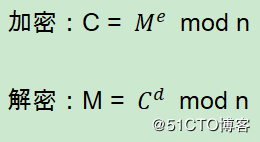
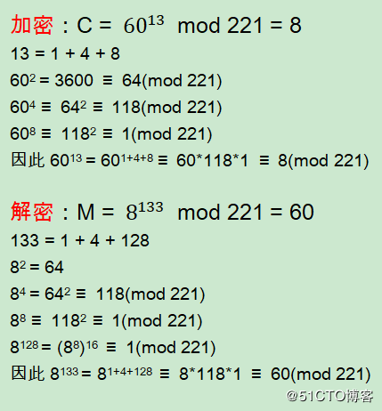
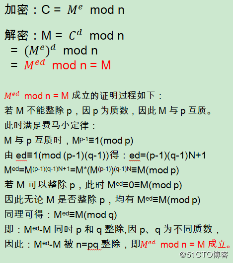
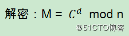
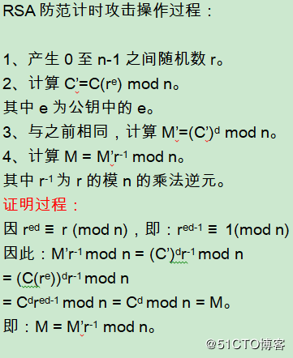

对称加密中，加密和解密使用相同的密钥，因此必须向解密者配送密钥，即密钥配送问题。而非对称加密中，由于加密和解密分别使用公钥和私钥，而公钥是公开的，因此可以规避密钥配送问题。非对称加密算法，也称公钥加密算法。
　　1977年，Ron Rivest、Adi Shamir、Leonard Adleman三人在美国公布了一种公钥加密算法，即RSA公钥加密算法。RSA是目前最有影响力和最常用的公钥加密算法，可以说是公钥加密算法的事实标准。

## 一、RSA加密原理

　　使用M和C分别表示明文和密文，则RSA加密、解密过程如下：



其中e、n的组合(e, n)即为公钥，d、n的组合(d, n)即为私钥。当然e、d、n并非任意取值，需要符合一定条件，如下即为e、d、n的求解过程。

### 生成密钥对

　　e、d、n的求解过程，也即生成密钥对的过程。涉及如下步骤：
　　1、取两个大质数（也称素数）p、q，n = pq。
　　2、取正整数e、d，使得ed mod (p-1)(q-1) = 1，也即：ed ≡ 1 mod (p-1)(q-1)。
　　e和d是模(p-1)(q-1)的乘法逆元，仅当e与(p-1)(q-1)互质时，存在d。
　　举例验证：
　　1、取p、q分别为13、17，n = pq = 221。
　　2、而(p-1)(q-1) = 12x16 = 192，取e、d分别为13、133，有13x133 mod 192 = 1
　　取明文M = 60，公钥加密、私钥解密，加密和解密过程分别如下：



### RSA加密原理证明过程



### 手动求解密钥对中的d

　　ed mod (p-1)(q-1) = 1，已知e和(p-1)(q-1)求d，即求e对模(p-1)(q-1)的乘法逆元。
　　如上面例子中，p、q为13、17，(p-1)(q-1)=192，取e=13，求13d mod 192 = 1中的d。
　　13d ≡ 1 (mod 192)，在右侧添加192的倍数，使计算结果可以被13整除。
　　13d ≡ 1 + 192x9 ≡ 13x133 (mod 192)，因此d = 133
　　其他计算方法有：费马小定律、扩展欧几里得算法、欧拉定理。

### RSA安全性

　　由于公钥公开，即e、n公开。
　　因此破解RSA私钥，即为已知e、n情况下求d。
　　因ed mod (p-1)(q-1) = 1，且n=pq，因此该问题演变为：对n质因数分解求p、q。
　　目前已被证明，已知e、n求d和对n质因数分解求p、q两者是等价的。实际中n长度为2048位以上，而当n>200位时分解n是非常困难的，因此RSA算法目前仍被认为是安全实用的。

### RSA计时***和防范

　　RSA解密的本质是模幂运算，即：



　其中C为密文，(d,n)为私钥，均为超过1024位的大数运算，直接计算并不可行，因此最经典的算法为蒙哥马利算法。而这种计算是比较是耗时的，因此者可以观察不同的输入对应的解密时间，通过分析推断私钥，称为计时。而防范RSA计时的办法，即在解密时加入随机因素，使得***者无法准确获取解密时间。   　　具体实现步骤如下： 



## 二、Go RSA加密解密

### 1、rsa加解密，必然会去查crypto/ras这个包

> Package rsa implements RSA encryption as specified in PKCS#1.

这是该包的说明：实现RSA加密技术，基于PKCS#1规范。

对于什么是PKCS#1，可以查阅相关资料。PKCS（公钥密码标准），而#1就是RSA的标准。可以查看：[PKCS系列简介](http://wenku.baidu.com/view/743f028102d276a200292e09.html)

从该包中函数的名称，可以看到有两对加解密的函数。

> EncryptOAEP和DecryptOAEP
> EncryptPKCS1v15和DecryptPKCS1v15

这称作加密方案，详细可以查看，[PKCS #1 v2.1 RSA 算法标准](http://wenku.baidu.com/view/58ba863610661ed9ad51f390.html)

可见，当与其他语言交互时，需要确定好使用哪种方案。

PublicKey和PrivateKey两个类型分别代表公钥和私钥，关于这两个类型中成员该怎么设置，这涉及到RSA加密算法，本文中，这两个类型的实例通过解析文章开头生成的密钥得到。

### 2、解析密钥得到PublicKey和PrivateKey的实例

这个过程，我也是花了好些时间（主要对各种加密的各种东东不熟）：怎么将openssl生成的密钥文件解析到公钥和私钥实例呢？

在encoding/pem包中，看到了—–BEGIN Type—–这样的字样，这正好和openssl生成的密钥形式差不多，那就试试。

在该包中，一个block代表的是PEM编码的结构，关于PEM，请查阅相关资料。我们要解析密钥，当然用Decode方法：

> func Decode(data []byte) (p *Block, rest []byte)

这样便得到了一个Block的实例（指针）。

解析来看crypto/x509。为什么是x509呢？这又涉及到一堆概念。先不管这些，我也是看encoding和crypto这两个包的子包摸索出来的。
在x509包中，有一个函数：

> func ParsePKIXPublicKey(derBytes []byte) (pub interface{}, err error)

从该函数的说明：*ParsePKIXPublicKey parses a DER encoded public key. These values are typically found in PEM blocks with “BEGIN PUBLIC KEY”*。可见这就是解析PublicKey的。另外，这里说到了PEM，可以上面的encoding/pem对了。（PKIX是啥东东，[查看这里](http://baike.baidu.com/view/2796599.htm) ）

而解析私钥的，有好几个方法，从上面的介绍，我们知道，RSA是PKCS#1，刚好有一个方法：

> func ParsePKCS1PrivateKey(der []byte) (key *rsa.PrivateKey, err error)

返回的就是rsa.PrivateKey。

## 代码实现：

```
package main
 
import (
	"crypto/rsa"
	"crypto/rand"
	"crypto/x509"
	"encoding/pem"
	"os"
	"fmt"
)
 
func RSAGenKey(bits int) error {
	/*
		生成私钥
	*/
	//1、使用RSA中的GenerateKey方法生成私钥
	privateKey, err := rsa.GenerateKey(rand.Reader, bits)
	if err != nil {
		return err
	}
	//2、通过X509标准将得到的RAS私钥序列化为：ASN.1 的DER编码字符串
	privateStream := x509.MarshalPKCS1PrivateKey(privateKey)
	//3、将私钥字符串设置到pem格式块中
	block1 := pem.Block{
		Type:  "private key",
		Bytes: privateStream,
	}
	//4、通过pem将设置的数据进行编码，并写入磁盘文件
	fPrivate, err := os.Create("privateKey.pem")
	if err != nil {
		return err
	}
	defer fPrivate.Close()
	err = pem.Encode(fPrivate, &block1)
	if err != nil {
		return err
	}
 
	/*
	生成公钥
	*/
	publicKey:=privateKey.PublicKey
	publicStream,err:=x509.MarshalPKIXPublicKey(&publicKey)
	//publicStream:=x509.MarshalPKCS1PublicKey(&publicKey)
	block2:=pem.Block{
		Type:"public key",
		Bytes:publicStream,
	}
	fPublic,err:=os.Create("publicKey.pem")
	if err!=nil {
		return  err
	}
	defer fPublic.Close()
	pem.Encode(fPublic,&block2)
	return nil
}
//对数据进行加密操作
func  EncyptogRSA(src []byte,path string) (res []byte,err error) {
	//1.获取秘钥（从本地磁盘读取）
	f,err:=os.Open(path)
	if err!=nil {
		return
	}
	defer f.Close()
	fileInfo,_:=f.Stat()
	b:=make([]byte,fileInfo.Size())
	f.Read(b)
	// 2、将得到的字符串解码
	block,_:=pem.Decode(b)
 
	// 使用X509将解码之后的数据 解析出来
	//x509.MarshalPKCS1PublicKey(block):解析之后无法用，所以采用以下方法：ParsePKIXPublicKey
	keyInit,err:=x509.ParsePKIXPublicKey(block.Bytes)  //对应于生成秘钥的x509.MarshalPKIXPublicKey(&publicKey)
	//keyInit1,err:=x509.ParsePKCS1PublicKey(block.Bytes)
	if err!=nil {
		return
	}
	//4.使用公钥加密数据
	pubKey:=keyInit.(*rsa.PublicKey)
	res,err=rsa.EncryptPKCS1v15(rand.Reader,pubKey,src)
	return
}
//对数据进行解密操作
func DecrptogRSA(src []byte,path string)(res []byte,err error)  {
	//1.获取秘钥（从本地磁盘读取）
	f,err:=os.Open(path)
	if err!=nil {
		return
	}
	defer f.Close()
	fileInfo,_:=f.Stat()
	b:=make([]byte,fileInfo.Size())
	f.Read(b)
	block,_:=pem.Decode(b)//解码
	privateKey,err:=x509.ParsePKCS1PrivateKey(block.Bytes)//还原数据
	res,err=rsa.DecryptPKCS1v15(rand.Reader,privateKey,src)
	return
}
func main() {
	//rsa.GenerateKey()
	err:=RSAGenKey(4096)
	if err!=nil {
		fmt.Println(err)
		return
	}
	fmt.Println("秘钥生成成功！")
	str:="山重水复疑无路，柳暗花明又一村！"
	fmt.Println("加密之前的数据为：",string(str))
	data,err:=EncyptogRSA([]byte(str),"publicKey.pem")
	data,err=DecrptogRSA(data,"privateKey.pem")
	fmt.Println("加密之后的数据为：",string(data))
}
```

