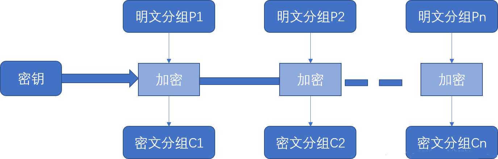
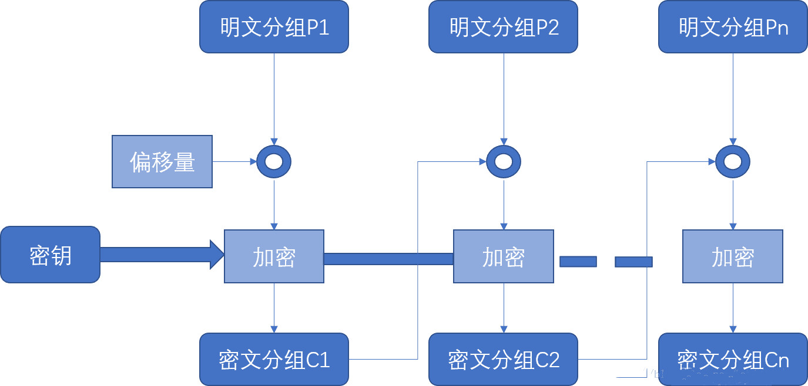

### 概念理解

DES是以64比特的明文为一个单位来进行加密，并生成64比特的密文。由于它每次只能处理特定长度的一块数据，所以DES属于分组密码算法。`cypto/des`包提供了有关des加密的功能。

### 模式

由于分组密码算法只能加密固定长度的分组，所以当加密的明文超过分组密码的长度时，就需要对分组密码算法进行迭代，而迭代的方法就称为分组密码的模式。模式主要有ECB(电子密码本)、CBC(密码分组链接模式)、CTR(计数器模式)、OFB(输出反馈模式)、CFB(密码反馈模式)五种。下面简单介绍下前两种：

1. ECB(electronic code book)是最简单的方式，它将明文分组加密后的结果直接成为密文分组。

优缺点：模式操作简单；明文中的重复内容将在密文中表现出来，特别对于图像数据和明文变化较少的数据；适于短报文的加密传递。



2. CBC(cipher block chaining)的原理是加密算法的输入是当前的明文分组和前一密文分组的异或，第一个明文分组和一个初始向量进行异或，这样同一个明文分组重复出现时会产生不同的密文分组。 特点：同一个明文分组重复出现时产生不同的密文分组；加密函数的输入是当前的明文分组和前一个密文分组的异或；每个明文分组的加密函数的输入与明文分组之间不再有固定的关系；适合加密长消息。 

   

   ### 填充方式

   在按8个字节对DES进行加密或解密时，如果最后一段字节不足8位，就需要对数据进行补位。即使加密或解密的数据刚好是8的倍数时，也会再补8位。举个栗子，如果末尾刚好出现1，这时你就无法判断这个1是原来数据，还是经过补位得到的1。因此，可以再补8位进行标识。填充方式主要有以下几种：pkcs7padding、pkcs5padding、zeropadding、iso10126、ansix923。

   1. pkcs7padding和pkcs5padding的填充方式相同，填充字节的值都等于填充字节的个数。例如需要填充4个字节，则填充的值为”4 4 4 4”。
   2. zeropadding填充字节的值都为0。

   ### 密码

   DES的密钥长度是64比特，但由于每隔7个比特会设置一个用于错误检测的比特，因此其实质密钥长度为56比特。

   ### 偏移量

   上面模式中，例如CBC，再加密第一个明文分组时，由于不存在“前一个密文分组”，因此需要事先准备一个长度为一个分组的比特序列来代替“前一个密文分组”，这个比特序列成为初始化向量，也称偏移量，通常缩写为IV。一般来说，每次加密时都会随机产生一个不同的比特序列来作为初始化向量。偏移量的长度必须和块的大小相同。

   ### 输出

   加密后的字节在显示时可以进行hex和base64编码，hex是十六进制编码，base64是一种基于64个可打印字符来标识二进制数据的方法。

   ```go
   package main
    
   import (
   	"bytes"
   	"crypto/des"
   	"crypto/cipher"
   	"fmt"
   )
    
   //填充字符串（末尾）
   func PaddingText(str []byte, blockSize int) []byte {
   	//需要填充的数据长度
   	paddingCount := blockSize - len(str)%blockSize
   	//填充数据为：paddingCount ,填充的值为：paddingCount
   	paddingStr := bytes.Repeat([]byte{byte(paddingCount)}, paddingCount)
   	newPaddingStr := append(str, paddingStr...)
   	//fmt.Println(newPaddingStr)
   	return newPaddingStr
   }
    
   //去掉字符（末尾）
   func UnPaddingText(str []byte) []byte {
   	n := len(str)
   	count := int(str[n-1])
   	newPaddingText := str[:n-count]
   	return newPaddingText
   }
   //---------------DES加密  解密--------------------
   func EncyptogDES(src, key []byte) []byte {
   	//1、创建并返回一个使用DES算法的cipher.Block接口
   	block, _ := des.NewCipher(key)
   	//2、对数据进行填充
   	src1 := PaddingText(src, block.BlockSize())
    
   	//3.创建一个密码分组为链接模式，底层使用des加密的blockmode接口
   	iv := []byte("aaaabbbb")
   	blockMode := cipher.NewCBCEncrypter(block, iv)
   	//4加密连续的数据块
   	desc := make([]byte, len(src1))
   	blockMode.CryptBlocks(desc, src1)
   	return desc
   }
   func DecrptogDES(src,key[]byte) []byte {
   	//创建一个block的接口
   	block,_:=des.NewCipher(key)
   	iv := []byte("aaaabbbb")
   	//链接模式，创建blockMode接口
   	blockeMode:=cipher.NewCBCDecrypter(block,iv)
   	//解密
   	blockeMode.CryptBlocks(src,src)
   	//去掉填充
   	newText:=UnPaddingText(src)
   	return newText
   }
   //---------------DES加密  解密--------------------
   func Encyptog3DES(src, key []byte) []byte {
   	//des包下的三次加密接口
   	block,_:=des.NewTripleDESCipher(key)
   	src=PaddingText(src,block.BlockSize())
   	blockMode:=cipher.NewCBCEncrypter(block,key[:block.BlockSize()])
   	blockMode.CryptBlocks(src,src)
   	return src
   }
   func Decrptog3DES(src,key[]byte) []byte {
   	block,_:=des.NewTripleDESCipher(key)
   	blockMode:=cipher.NewCBCDecrypter(block,key[:block.BlockSize()])
   	blockMode.CryptBlocks(src,src)
   	src=UnPaddingText(src)
   	return src
   }
   func main() {
   	fmt.Println("---------------DES加解密----------------------")
   	str:=[]byte("乌慢。。。")
   	fmt.Println("加密之前的数据为：",string(str))
   	key:=[]byte("12345678")
   	src:=EncyptogDES(str,key)
   	src=DecrptogDES(src,key)
   	fmt.Println("解密之后的数据为：",string(src))
    
   	fmt.Println("---------------3DES加解密----------------------")
   	str1:=[]byte("海内存知己天涯若比邻")
   	fmt.Println("加密之前的数据为：",string(str1))
   	key1:=[]byte("12345678abcdefgh98765432")
   	src1:=Encyptog3DES(str1,key1)
   	src1=Decrptog3DES(src1,key1)
   	fmt.Println("解密之后的数据为：",string(src1))
    
   }
   ```

   

