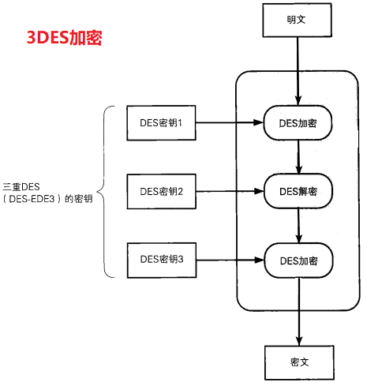
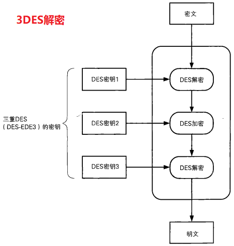

### 1.三重DES

> 现在DES已经可以在现实的时间内被暴力破解，因此我们需要一种用来替代DES的分组密码，三重DES就是出于这个目的被开发出来的。
>
> **三重DES（triple-DES）是为了增加DES的强度，==将DES重复3次所得到的一种密码算法==，通常缩写为3DES**。

#### 2.三重DES的加密

```
三重DES的加解密机制如图所示：

加->解->加 -> 目的是为了兼容des

3des秘钥长度24字节 = 1234567a 1234567b 1234567a

明文: 10

秘钥1: 2

秘钥2: 3

秘钥3: 4

加密算法: 明文+秘钥

解密算法: 密文-秘钥

10+2-3+4
```





> 明文经过三次DES处理才能变成最后的密文，由于**DES密钥的长度实质上是56比特**，因此三重DES的密钥长度就是56×3=168比特, 加上用于错误检测的标志位8x3, 共192bit。
>
> 从上图我们可以发现，三重DES并不是进行三次DES加密（加密-->加密-->加密），而是**加密-->解密-->加密**的过程。在加密算法中加人解密操作让人感觉很不可思议，实际上这个方法是IBM公司设计出来的，目的是为了让三重DES能够兼容普通的DES。
>
> 当三重DES中所有的密钥都相同时，三重DES也就等同于普通的DES了。这是因为在前两步加密-->解密之后，得到的就是最初的明文。因此，以前用DES加密的密文，就可以通过这种方式用三重DES来进行解密。也就是说，三重DES对DES具备向下兼容性。
>
> 如果密钥1和密钥3使用相同的密钥，而密钥2使用不同的密钥（也就是只使用两个DES密钥），这种三重DES就称为DES-EDE2。EDE表示的是加密（Encryption) -->解密（Decryption)-->加密（Encryption）这个流程。
>
> 密钥1、密钥2、密钥3全部使用不同的比特序列的三重DES称为DES-EDE3。

> 尽管三重DES目前还被银行等机构使用，但其处理速度不高，而且在安全性方面也逐渐显现出了一些问题。

#### 3.Go中对3DES的操作

##### 加解密实现思路

- **加密 - CBC分组模式**

  > 1. 创建并返回一个使用3DES算法的cipher.Block接口
  >    - **秘钥长度为64bit*3=192bit, 即 192/8 = 24字节(byte)**
  > 2. 对最后一个明文分组进行数据填充
  >    - 3DES是以64比特的明文（比特序列）为一个单位来进行加密的
  >    - 最后一组不够64bit, 则需要进行数据填充( **参考第三章**)
  > 3. 创建一个密码分组为链接模式的, 底层使用3DES加密的BlockMode接口
  > 4. 加密连续的数据块

- **解密**

  > 1. 创建并返回一个使用3DES算法的cipher.Block接口
  > 2. 创建一个密码分组为链接模式的, 底层使用3DES解密的BlockMode接口
  > 3. 数据块解密
  > 4. 去掉最后一组的填充数据

##### 加解密的代码实现

3DES加密代码

```
// 3DES加密
func TripleDESEncrypt(src, key []byte) []byte {
	// 1. 创建并返回一个使用3DES算法的cipher.Block接口
	block, err := des.NewTripleDESCipher(key)
	if err != nil{
		panic(err)
	}
	// 2. 对最后一组明文进行填充
	src = PKCS5Padding(src, block.BlockSize())
	// 3. 创建一个密码分组为链接模式, 底层使用3DES加密的BlockMode模型
	blockMode := cipher.NewCBCEncrypter(block, key[:8])
	// 4. 加密数据
	dst := src
	blockMode.CryptBlocks(dst, src)
	return dst
}
```

3DES解密代码

```
// 3DES解密
func TripleDESDecrypt(src, key []byte) []byte {
	// 1. 创建3DES算法的Block接口对象
	block, err := des.NewTripleDESCipher(key)
	if err != nil{
		panic(err)
	}
	// 2. 创建密码分组为链接模式, 底层使用3DES解密的BlockMode模型
	blockMode := cipher.NewCBCDecrypter(block, key[:8])
	// 3. 解密
	dst := src
	blockMode.CryptBlocks(dst, src)
	// 4. 去掉尾部填充的数据
	dst = PKCS5UnPadding(dst)
	return dst
}
```

重要的函数说明

1. 生成一个底层使用3DES加/解密的Block接口对象

   ```go
   函数对应的包: import "crypto/des"
   func NewTripleDESCipher(key []byte) (cipher.Block, error)
   	- 参数 key: 3des对称加密使用的密码, 密码长度为(64*3)bit, 即(8*3)byte
   	- 返回值 cipher.Block: 创建出的使用DES加/解密的Block接口对象
   ```

2. 创建一个密码分组为CBC模式, 底层使用b加密的BlockMode接口对象

   ```go
   函数对应的包: import "crypto/cipher"
   func NewCBCEncrypter(b Block, iv []byte) BlockMode
       - 参数 b: 使用des.NewTripleDESCipher 函数创建出的Block接口对象
       - 参数 iv: 事先准备好的一个长度为一个分组长度的比特序列, 每个分组为64bit, 即8byte
       - 返回值: 得到的BlockMode接口对象
   ```

3. 使用cipher包的BlockMode接口对象对数据进行加/解密

   ```go
   接口对应的包: import "crypto/cipher"
   type BlockMode interface {
       // 返回加密字节块的大小
       BlockSize() int
       // 加密或解密连续的数据块，src的尺寸必须是块大小的整数倍，src和dst可指向同一内存地址
       CryptBlocks(dst, src []byte)
   }
   接口中的 CryptBlocks(dst, src []byte) 方法:
       - 参数 dst: 传出参数, 存储加密或解密运算之后的结果 
       - 参数 src: 传入参数, 需要进行加密或解密的数据切片(字符串)
   ```

4. 创建一个密码分组为CBC模式, 底层使用b解密的BlockMode接口对象

   ```go
   函数对应的包: import "crypto/cipher"
   func NewCBCDecrypter(b Block, iv []byte) BlockMode
       - 参数 b: 使用des.NewTripleDESCipher 函数创建出的Block接口对象
       - 参数 iv: 事先准备好的一个长度为一个分组长度的比特序列, 每个分组为64bit, 即8byte, 
                  该序列的值需要和NewCBCEncrypter函数的第二个参数iv值相同
       - 返回值: 得到的BlockMode接口对象
   ```

