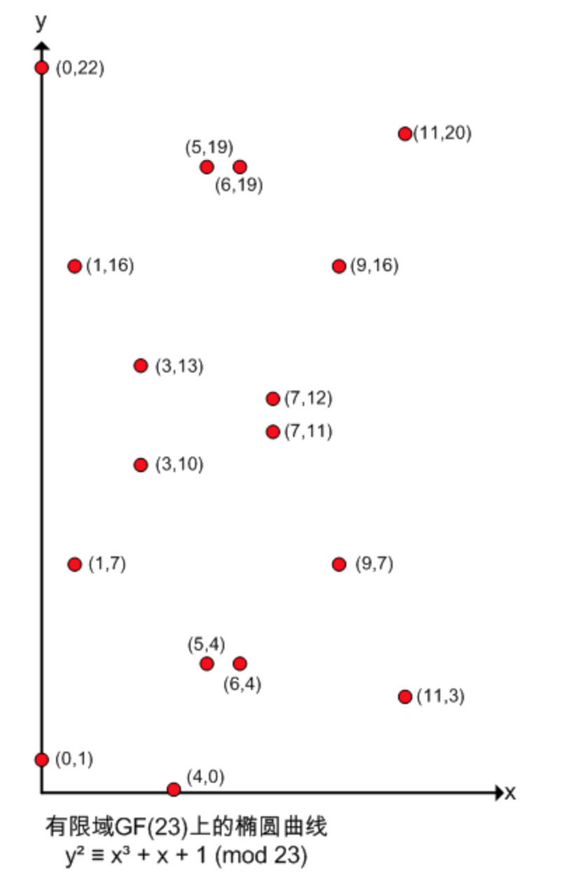

椭圆曲线加密算法，即：Elliptic Curve Cryptography，简称ECC，是基于椭圆曲线数学理论实现的一种非对称加密算法。相比RSA，ECC优势是可以使用更短的密钥，来实现与RSA相当或更高的安全。据研究，160位ECC加密安全性相当于1024位RSA加密，210位ECC加密安全性相当于2048位RSA加密。

　　椭圆曲线在密码学中的使用，是1985年由Neal Koblitz和Victor Miller分别独立提出的。 

## 椭圆曲线

一般情况下，椭圆曲线可用下列方程式来表示，其中a,b,c,d为系数。

> E:y2=ax3+ bx2+cx+d

例如，当a=1,b=0,c=-2,d=4时，所得到的椭圆曲线为:

> E:y2=x3-2x+4

该椭圆曲线E的图像如图X-1所示，可以看出根本就不是椭圆形。　　


## 定义椭圆曲线的运算规则

### 加法

过曲线上的两点A、B画一条直线，找到直线与椭圆曲线的交点，交点关于x轴对称位置的点，定义为A+B，即为加法。如下图所示：A + B = C


### 二倍运算

上述方法无法解释A + A，即两点重合的情况。因此在这种情况下，将椭圆曲线在A点的切线，与椭圆曲线的交点，交点关于x轴对称位置的点，定义为A + A，即2A，即为二倍运算。


### 正负取反

将A关于x轴对称位置的点定义为-A，即椭圆曲线的正负取反运算。如下图所示：


### 无穷远点

如果将A与-A相加，过A与-A的直线平行于y轴，可以认为直线与椭圆曲线相交于无穷远点。

综上，定义了A+B、2A运算，因此给定椭圆曲线的某一点G，可以求出2G、3G（即G + 2G）、4G……。即：当给定G点时，已知x，求xG点并不困难。反之，已知xG点，求x则非常困难。此即为椭圆曲线加密算法背后的数学原理。

## 有限域上的椭圆曲线运算

椭圆曲线要形成一条光滑的曲线，要求x,y取值均为实数，即实数域上的椭圆曲线。但椭圆曲线加密算法，并非使用实数域，而是使用有限域。按数论定义，有限域GF(p)指给定某个质数p，由0、1、2……p-1共p个元素组成的整数集合中定义的加减乘除运算。

　　假设椭圆曲线为y² = x³ + x + 1，其在有限域GF(23)上时，写作： 
　　y² ≡ x³ + x + 1 (mod 23)

　　此时，椭圆曲线不再是一条光滑曲线，而是一些不连续的点，如下图所示。以点(1,7)为例，7² ≡ 1³ + 1 + 1 ≡ 3 (mod 23)。如此还有如下点：

　　(0,1) (0,22) 
　　(1,7) (1,16) 
　　(3,10) (3,13) 
　　(4,0) 
　　(5,4) (5,19) 
　　(6,4) (6,19) 
　　(7,11) (7,12) 
　　(9,7) (9,16) 
　　(11,3) (11,20) 
　　等等。

　　另外，如果P(x,y)为椭圆曲线上的点，则-P即(x,-y)也为椭圆曲线上的点。如点P(0,1)，-P=(0,-1)=(0,22)也为椭圆曲线上的点。



### 计算xG

　　相关公式如下： 
　　有限域GF(p)上的椭圆曲线y² = x³ + ax + b，若P(Xp, Yp), Q(Xq, Yq)，且P≠-Q，则R(Xr,Yr) = P+Q 由如下规则确定：

　　Xr = (λ² - Xp - Xq) mod p 
　　Yr = (λ(Xp - Xr) - Yp) mod p 
　　其中λ = (Yq - Yp)/(Xq - Xp) mod p（若P≠Q）, λ = (3Xp² + a)/2Yp mod p（若P=Q）

　　因此，有限域GF(23)上的椭圆曲线y² ≡ x³ + x + 1 (mod 23)，假设以(0,1)为G点，计算2G、3G、4G…xG等等，方法如下：

　　计算2G： 
　　λ = (3x0² + 1)/2x1 mod 23 = (1/2) mod 23 = 12 
　　Xr = (12² - 0 - 0) mod 23 = 6 
　　Yr = (12(0 - 6) - 1) mod 23 = 19 
　　即2G为点(6,19)

　　计算3G： 
　　3G = G + 2G，即(0,1) + (6,19) 
　　λ = (19 - 1)/(6 - 0) mod 23 = 3 
　　Xr = (3² - 0 - 6) mod 23 = 3 
　　Yr = (3(0 - 3) - 1) mod 23 = 13 
　　即3G为点(3, 13)

　　同理计算4G、5G…xG，分布如下图： 
　　[图片上传失败…(image-2d5c43-1526642990683)] 

## 椭圆曲线加解密算法原理

　　建立基于椭圆曲线的加密机制，需要找到类似RSA质因子分解或其他求离散对数这样的难题。而椭圆曲线上的已知G和xG求x，是非常困难的，此即为椭圆曲线上的的离散对数问题。此处x即为私钥，xG即为公钥。

　　椭圆曲线加密算法原理如下：

　　设私钥、公钥分别为k、K，即K = kG，其中G为G点。

　　公钥加密： 
　　选择随机数r，将消息M生成密文C，该密文是一个点对，即： 
　　C = {rG, M+rK}，其中K为公钥

　　私钥解密： 
　　M + rK - k(rG) = M + r(kG) - k(rG) = M 
　　其中k、K分别为私钥、公钥。

## 椭圆曲线签名算法原理

　　椭圆曲线签名算法，即ECDSA。 
　　设私钥、公钥分别为k、K，即K = kG，其中G为G点。

　　私钥签名： 
　　1、选择随机数r，计算点rG(x, y)。 
　　2、根据随机数r、消息M的哈希h、私钥k，计算s = (h + kx)/r。 
　　3、将消息M、和签名{rG, s}发给接收方。

　　公钥验证签名： 
　　1、接收方收到消息M、以及签名{rG=(x,y), s}。 
　　2、根据消息求哈希h。 
　　3、使用发送方公钥K计算：hG/s + xK/s，并与rG比较，如相等即验签成功。

　　原理如下： 
　　hG/s + xK/s = hG/s + x(kG)/s = (h+xk)G/s 
　　= r(h+xk)G / (h+kx) = rG

## 代码实现：

```
package main
import (
    "crypto/ecdsa"
    "crypto/elliptic"
    "crypto/rand"
    "crypto/sha256"
    "math/big"
    "fmt"
)
//通过椭圆曲线完成签名和验证
func main() {
    //声明明文
    message := []byte("hello world")
    //生成私钥
    privateKey, _ := ecdsa.GenerateKey(elliptic.P256(), rand.Reader)
    //生成公钥
    pub := privateKey.PublicKey
    //将明文散列
    digest := sha256.Sum256(message)
    //签名
    r, s, _ := ecdsa.Sign(rand.Reader, privateKey, digest[:])
    //设置私钥的参数类型为曲线类型
    param := privateKey.Curve.Params()
    //获得私钥byte长度
    curveOrderByteSize := param.P.BitLen() / 8
    //获得签名返回值的字节
    rByte, sByte := r.Bytes(), s.Bytes()
    //创建数组
    signature := make([]byte, curveOrderByteSize*2)
    //通过数组保存了签名结果的返回值
    copy(signature[curveOrderByteSize-len(rByte):], rByte)
    copy(signature[curveOrderByteSize*2-len(sByte):], sByte)
    //认证
    //将明文做hash散列，为了验证的内容对比
    digest = sha256.Sum256(message)
    curveOrderByteSize = pub.Curve.Params().P.BitLen() / 8
    //创建两个整形对象
    r, s = new(big.Int), new(big.Int)
    //设置证书值
    r.SetBytes(signature[:curveOrderByteSize])
    s.SetBytes(signature[curveOrderByteSize:])
 
 
​```
//认证
e := ecdsa.Verify(&pub, digest[:], r, s)
if e == true {
    fmt.Println("OK")
} else {
    fmt.Println("failed")
}
​```
 
}

```

