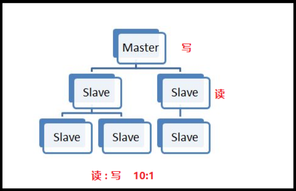
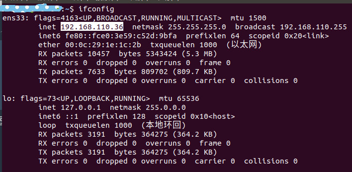
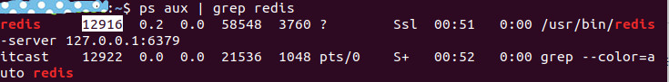
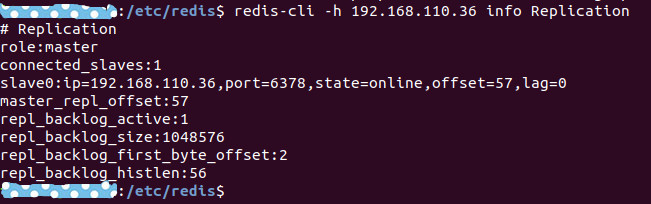
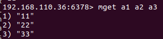

## **1.6搭建主从**

**主从概念**

a) 一个master可以拥有多个slave，一个slave可以拥有多个slave，如此下去，形成了强⼤的多级服务器集群架构

b) master用来写数据，slave用来读数据，经统计：网站的读写比率是10:1

c) 通过主从配置可以实现读写分离

d) master和slave都是一个redis实例



**主从配置**

**配置主**

a) 查看当前主机的ip地址

```
ifconfig
```



a) 修改etc/redis/redis.conf文件"

```
sudo vi redis.conf
bind 192.168.110.36
```

a) 重启redis服务

```
ps aux | grep redis
```



```
Sudo kill -9 12916
Sudo redis-server /etc/redis/redis.conf
```

这里需要注意一下，如果以服务启动的话需要手动停止服务，命令

```
sudo service redis stop   //这里停止服务
```

停止服务完然后su一下，然后删除里面/var/lib/redis下面的dump文件

**配置从**

a) 复制etc/redis/redis.conf文件

```
sudo cp redis.conf ./slave.conf
```

a) 修改redis/slave.conf文件

```
sudo vi slave.conf
```

a) 编辑内容

```
bind 192.168.110.36
slaveof 192.168.110.36 6379
port 6378
```

a) 开启redis服务

```
sudo redis-server slave.conf
```

a) 查看主从关系

```
redis-cli -h 192.168.110.36 info Replication
```



**操作数据**

a) 进入主客户端

```
redis-cli -h 192.168.110.36 -p 6379
```

b) 进入从客户端

```
redis-cli -h 192.168.110.36 -p 6378
```

c) 在master上写数据

```
mset a1 11 a2 22 a3 33
```


a) 在slave上读数据



### 注意：如果出错，可以查看日志文件，

### su 进入管理员用户 ，密码，然后cd  /var/log/redis   然后查看redis.log文件